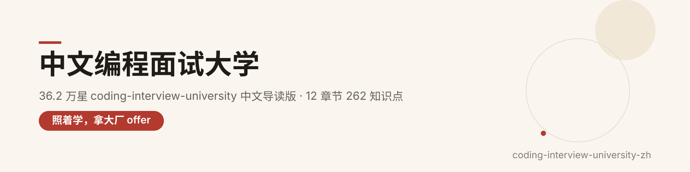
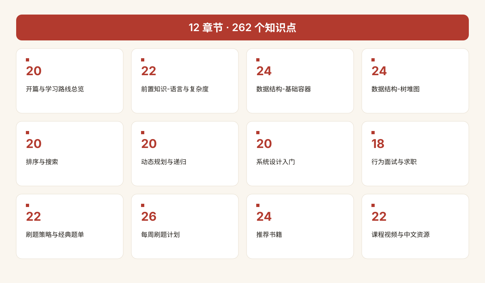
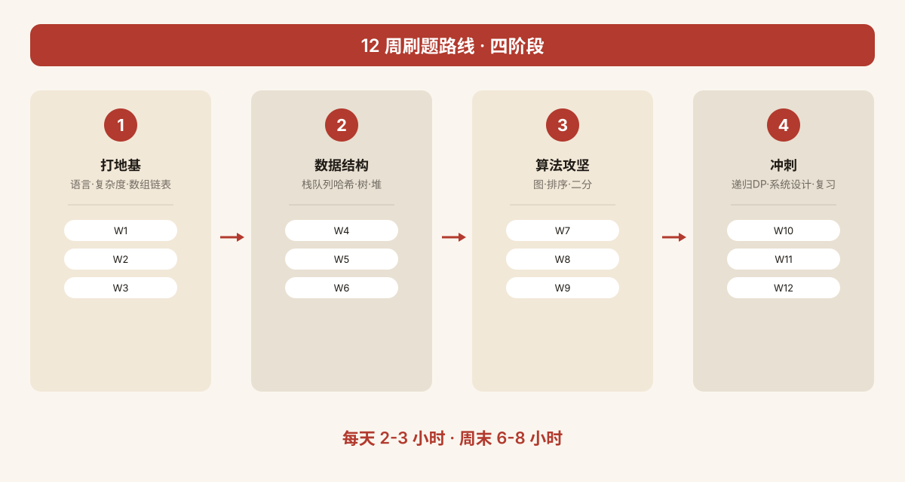

  

<h1 align="center">coding-interview-university-zh</h1>

> **36.2 万 star 的「编码面试大学」，终于有中文导读版了。**
>
> 从 GitHub 顶流自学计划 [jwasham/coding-interview-university](https://github.com/jwasham/coding-interview-university)（CC-BY-SA-4.0，36.2 万 star）里精选整理成 **12 个章节、262 个知识点**：每个主题都配中文导读、核心知识点清单、原项目真实链接与学习提示，还有**每周刷题计划表（Week 1-12）**和**经典题单**两大收藏板块。

---

⭐ 如果对你有帮助，点个 Star 支持中文开源

## ✨ 为什么值得收藏

- **12 章节 / 262 个知识点**：从语言与复杂度到系统设计、行为面试，一条龙；
- **导读制**：每个主题先讲「是什么、为什么重要」，再给知识点与链接，不让你对着英文原文发呆；
- **两大亮点板块**：Week 1-12 每周刷题计划表（周次/主题/目标/刷题方向/时长）+ 经典题单，直接照着执行；
- **链接真实可核验**：全部原样取自原项目清单，零占位符、零编造；
- **中文资源补充**：附原项目官方中文翻译入口与中文学习资源线索。

---

## 🗂 章节总览

| # | 章节 | 知识点 | # | 章节 | 知识点 |
| --- | --- | --- | --- | --- | --- |
| 1. 开篇与学习路线总览 | 20 | 7. 系统设计入门 | 20 |
| 2. 前置知识：语言与复杂度 | 22 | 8. 行为面试与求职 | 18 |
| 3. 数据结构：基础容器 | 24 | 9. 刷题策略与经典题单 | 22 |
| 4. 数据结构：树·堆·图 | 24 | 10. 每周刷题计划 Week 1-12 | 26 |
| 5. 排序与搜索 | 20 | 11. 推荐书籍 | 24 |
| 6. 动态规划与递归 | 20 | 12. 课程视频与中文资源 | 22 |

| **合计** | **12 个章节** | **262 个知识点** |  |  |  |

  

---

## 🚀 新手四步走

1. **先读 01 开篇**：搞清这份计划是什么、每天投入多少（原计划建议每天 2-3 小时、周末 6-8 小时）；
2. **定语言看 02**：选一门面试语言，把复杂度和 Big-O 吃透再往下；
3. **按 10 每周刷题计划走**：Week 1-12 每周围绕一个主题学+刷，表格照着执行；
4. **面试前过 07/08/09**：系统设计入门、行为面试、经典题单冲刺。

> 知识点顺序参考原项目知识体系：语言 → 复杂度 → 数组/链表 → 栈/队列/哈希 → 树 → 堆 → 图 → 排序 → 搜索 → 递归/DP → 系统设计。

  

---

## 📖 使用说明

- 每章先读「中文导读」，再逐条过「知识点」；每条知识点含：**知识点名 + 一句话中文说明 + 原项目真实链接**；
- `> 💡 学习提示` 是给对应主题的实践建议（看哪个视频、刷哪类题、注意什么坑）；
- 链接均来自原仓库清单；个别知识点无链接（纯概念/方法论），不影响使用。

---

# 章节正文

## 1. 开篇与学习路线总览（20 个知识点）

> 本章是整套面试备考计划的"使用说明书"：先花十分钟搞清它从哪来、适合谁、每天怎么推进，再把作者用几个月真金白银换来的避坑经验一次性吸收，能帮你省下大量走弯路的时间。

## 这份计划是什么、适合谁

先定位方向：避免学了半个月才发现自己走错了片场。

- **数月开源自学路线图**：作者本人为冲刺大厂软件工程师岗位整理的跨月学习计划，经数十万社区学习者验证，不是零散题单，而是一条成体系的路线。
- **三个入门条件**：只需要最基础的编程概念（变量、循环、函数）、外加耐心和时间；科班学历并非入场券。
- **约七成 CS 核心即可上场**：大学计算机系的内容浩如烟海，但面试只考其中最核心的一块，作者把这块抽了出来；非科班者照此推进，相当于用数月追平别人数年的课业。

> 💡 学习提示：开工前先通读整份 README 当地图用——知道终点长什么样，再选最近的那条路，比一头扎进视频堆里高效得多。

## 怎么上手、怎么安排每天

工具与节奏一旦定下来，后面几个月才不会乱套。

- **用 GitHub 任务清单打卡**：仓库本身就是一张带勾选框的进度表，学会把 Markdown 任务列表里的 `[ ]` 勾成 `[x]`，完成度一目了然 ——[🔗 GitHub Flavored Markdown 指南](https://guides.github.com/features/mastering-markdown/#GitHub-flavored-markdown)
- **不会 Git 也能学**：直接点仓库页面的 Code → Download ZIP，解压后用任意 Markdown 编辑器打开就能按顺序学 ——[🔗 下载位置官方图示](https://d3j2pkmjtin6ou.cloudfront.net/how-to-download-as-zip.png)
- **每日节奏：看视频 + 手写实现**：每天取下一个主题，看完视频后用你选定的语言亲手把这个数据结构/算法写一遍；作者的 Python 参考实现可对照 ——[🔗 作者 Python 练习仓](https://github.com/jwasham/practice-python)
- **C 语言参考实现**：想读贴近指针与手动内存管理的手写版本，看这份 ——[🔗 作者 C 练习仓](https://github.com/jwasham/practice-c)
- **C++ 参考实现**：想要现代 C++ 风格的对照代码，看这份 ——[🔗 作者 C++ 练习仓](https://github.com/jwasham/practice-cpp)

> 💡 学习提示：不必背下每个算法的标准答案，目标只是"理解到能默写出自己的实现"这一程度。

## 作者踩过的坑（让你少走几个月弯路）

下面是作者拿时间换回来的教训，照着做就能直接绕开。

- **坑一：笔记当时懂、过后全忘**：作者曾狂看视频记了大量笔记，三个月后却几乎全不记得；开工前先读这篇关于如何留存 CS 知识的方法论文章 ——[🔗 Retaining Computer Science Knowledge](https://startupnextdoor.com/retaining-computer-science-knowledge/)
- **用闪卡对抗遗忘**：作者为此专门写了一个开源闪卡站，区分"普通卡"与"代码卡"两种格式，手机端随拿随刷 ——[🔗 闪卡站开源仓库](https://github.com/jwasham/computer-science-flash-cards)
- **不建议直接照搬作者卡库**：作者自己攒的 1200 张卡里混了大量面试根本用不上的冷知识，最多当反面教材看看 ——[🔗 作者 1200 张卡库](https://github.com/jwasham/computer-science-flash-cards/blob/main/cards-jwasham.db)
- **极端版更不必碰**：1800 张版从汇编、Python 冷知识一路盖到机器学习和统计学，远超面试所需 ——[🔗 1800 张极端卡库](https://github.com/jwasham/computer-science-flash-cards/blob/main/cards-jwasham-extreme.db)
- **更省心的替代：Anki**：被无数人推荐的主流间隔重复软件，全平台云同步；iOS 版付费，其余平台免费 ——[🔗 Anki 官网](http://ankisrs.net/)
- **边学边刷题，别等学完**：每学完一个主题（比如链表）就立刻做 2-3 道对应题，过段时间再回来补几题——面试考的是你运用知识的能力，而非记住了多少知识。

> 💡 学习提示：闪卡第一次认出答案时别急着标"已掌握"，得同一张卡连续答对好几次才算真记住——重复才会把知识压进长期记忆。

## 收尾冲刺与计划边界

全部主题过完后，靠短片快速回炉，同时认清这套计划不管什么。

- **23 集 2-3 分钟速览短片**：每集只讲一个核心概念，通勤、排队时拿出来反复过 ——[🔗 复习短片合集](https://www.youtube.com/watch?v=r4r1DZcx1cM&list=PLmVb1OknmNJuC5POdcDv5oCS7_OUkDgpj&index=22)
- **Michael Sambol 48 集短课**：另一套体系化的 2-5 分钟专题视频系列，覆盖面很全 ——[🔗 频道主页](https://www.youtube.com/@MichaelSambol)
- **配套 DSA 代码示例**：与上述视频一一对应的可运行代码仓 ——[🔗 msambol/dsa](https://github.com/msambol/dsa)
- **Sedgewick《算法 I》**：普林斯顿大师在 Coursera 上的经典课，适合后期系统复盘 ——[🔗 Algorithms Part I](https://www.coursera.org/learn/algorithms-part1)
- **Sedgewick《算法 II》**：聚焦图论与进阶分析的下半部 ——[🔗 Algorithms Part II](https://www.coursera.org/learn/algorithms-part2)
- **计划边界**：这套路线不含 JavaScript、HTML/CSS 等前端技术，也不含 SQL；目标若是前端或全栈岗，请另找路线图，别在错的方向上耗时间。

> 💡 学习提示：临考一周不要再开新坑，只循环刷上述短片和自己的闪卡，把已学过的东西"激活"出来比学新东西重要得多。

## 2. 前置知识：语言选择与复杂度分析（22 个知识点）

> 正式进入数据结构之前，要先定好"用哪门语言学"和"怎么衡量算法快慢"这两件事——它们是后续十几个章节的共同地基：语言选错会反复返工，不懂复杂度则无法判断自己的解法够不够好。

## 面试语言怎么选

语言不在多而在精，先定一门再谈深入。

- **学习语言 = 面试语言**：尽量让钻研 CS 概念用的语言和面试刷题用的语言是同一门，避免在两门语言间来回切换、两边都不精。
- **为什么用 C 打底**：C 让你直接面对指针和手动内存管理，数据结构像长在身上；Python、Java 把这些都藏了起来，学底层原理时反而隔着一层。配套经典教材 K&R 不必读完，能流畅读写即可 ——[🔗 The C Programming Language（K&R）](https://www.amazon.com/Programming-Language-Brian-W-Kernighan/dp/0131103628)
- **Python 的定位**：现代、表达力极强，同样思路下代码量更少、写得更快，是作者刷题时的另一门主力。
- **大厂稳妥三选**：C++、Java、Python 是大公司面试中最稳妥的选择；JavaScript、Ruby 也能用，但先查清楚各平台兼容性与陷阱再决定。
- **作者亲撰方法论**：为什么面试只该锁定一门语言的完整论证 ——[🔗 Pick One Language for the Coding Interview](https://startupnextdoor.com/important-pick-one-language-for-the-coding-interview/)
- **观点源头原文**：上述文章参考的经典讨论存档版 ——[🔗 Choosing a Programming Language for Interviews](https://web.archive.org/web/20210516054124/http://blog.codingforinterviews.com/best-programming-language-jobs/)
- **第三方对照视角**：另一份"如何为面试选对语言"的详细分析 ——[🔗 Choose the Right Language for Your Coding Interview](http://www.byte-by-byte.com/choose-the-right-language-for-your-coding-interview/)
- **分语言资源索引**：仓库为各主流语言单独整理的配套资料专页 ——[🔗 programming-language-resources.md](programming-language-resources.md)

> 💡 学习提示：选定后至少两三个月内不要再换语言——临场熟练度比语言本身的微小优势更影响面试表现。

## 练语言的在线平台

语言定下来后，用短平快的小题目把手感练出来。

- **Exercism**：带教练式反馈的多语言练习平台，适合系统过一遍语法与惯用法 ——[🔗 Exercism 练习轨道](https://exercism.org/tracks)
- **Codewars**：按"武道"分级的社区题单，由易到难刷小题找手感 ——[🔗 Codewars](http://www.codewars.com)
- **HackerEarth**：面向开发者的练习与竞赛平台，题量充足 ——[🔗 HackerEarth for Developers](https://www.hackerearth.com/for-developers/)
- **Scaler Topics**：偏 Java / C++ 方向的系统化专题教程 ——[🔗 Scaler Topics](https://www.scaler.com/topics/)
- **Programiz**：社区驱动的编程挑战与教程 ——[🔗 Programiz PRO](https://programiz.pro/)

> 💡 学习提示：语言平台只用来"热身"，每天 1-2 题保持手感即可，别在这里消耗掉刷算法题的主要时间。

## 算法复杂度与 Big-O（核心视频）

本节不用写代码，看视频建立直觉即可。

- **学法：不必死磕数学推导**：你不需要推懂每一条证明，目标只是"会用 Big-O 表达一个算法随输入规模增长的代价"，看不懂的数学先跳过。
- **哈佛 CS50 渐近记号**：最经典的入门课，用直观例子讲清楚 O 记号到底在算什么 ——[🔗 CS50 - Asymptotic Notation](https://www.youtube.com/watch?v=iOq5kSKqeR4)
- **O / Ω / Θ 的严格数学含义**：把上界、下界、确界三者一次讲透的数学向讲解 ——[🔗 Big O, Omega and Theta](https://www.youtube.com/watch?v=ei-A_wy5Yxw&index=2&list=PL1BaGV1cIH4UhkL8a9bJGG356covJ76qN)
- **Skiena 教授亲授**：《算法设计手册》作者的课堂录像，工程味道很浓 ——[🔗 Skiena Lecture](https://www.youtube.com/watch?v=z1mkCe3kVUA)
- **伯克利 Big-O 公开课**：名校公开课视角的复杂度入门 ——[🔗 UC Berkeley Big O](https://archive.org/details/ucberkeley_webcast_VIS4YDpuP98)
- **摊还分析专题**：讲清动态数组"偶尔扩容"为什么均摊下来仍然高效 ——[🔗 Amortized Analysis](https://www.youtube.com/watch?v=B3SpQZaAZP4&index=10&list=PL1BaGV1cIH4UhkL8a9bJGG356covJ76qN)

> 💡 学习提示：视频不必刷完，看到自己能口头说出一段代码的时间复杂度，就可以放心换下一个主题。

## 复杂度速查与进阶

看完视频后，用这两份资料把知识点钉在桌面上。

- **Topcoder 复杂度教程（上）**：系统讲解计算复杂度，并覆盖递推关系与主定理 ——[🔗 Computational Complexity Part 1](https://www.topcoder.com/thrive/articles/Computational%20Complexity%20part%20one)
- **Topcoder 复杂度教程（下）**：上篇的续篇，讲完剩余分析工具 ——[🔗 Computational Complexity Part 2](https://www.topcoder.com/thrive/articles/Computational%20Complexity%20part%20two)
- **Big-O 速查表**：常见数据结构与排序算法的复杂度一览表，面试前打印贴墙 ——[🔗 Big-O Cheat Sheet](http://bigocheatsheet.com/)

> 💡 学习提示：《Cracking the Coding Interview》里有一章复杂度自测题，学完本节去做一遍，能立刻暴露那些"以为懂了其实没懂"的地方。

## 3. 数据结构-基础容器（24 个知识点）

> 本章覆盖面试中最高频的六种基础容器：数组/动态数组、链表、栈、队列、哈希表与字符串。它们几乎出现在每一道 coding 题里，重点不是背代码，而是讲清"为什么这种结构快/慢、什么时候该用它"。

## 数组与动态数组

数组是所有容器的地基，动态数组（vector/ArrayList）则是工程里真正天天用的形态。

- **数组的连续内存布局**：数组把元素紧挨着放在一段连续内存里，靠下标直接寻址，访问是 O(1)；代价是中间插入/删除要整体挪动，O(n)。理解"连续"二字是后面所有缓存友好讨论的起点。——[🔗 Arrays CS50 Harvard](https://www.youtube.com/watch?v=tI_tIZFyKBw&t=3009s)
- **动态数组的自动扩容**：当容量不够时整体复制到一块 2 倍大的新数组，因此尾部均摊插入仍是 O(1)；当元素掉到容量 1/4 时再缩半，避免空间浪费。这是 vector/ArrayList 的核心机制。——[🔗 Dynamic Arrays (Coursera)](https://www.coursera.org/lecture/data-structures/dynamic-arrays-EwbnV)
- **手写 vector 的接口清单**：要能从零实现 size/capacity/at/push/insert/prepend/pop/delete/find，以及私有 resize；这道题能一次性把"下标越界、边界拷贝、扩容时机"全暴露出来。——[🔗 UC Berkeley CS61B 线性与多维数组](https://archive.org/details/ucberkeley_webcast_Wp8oiO_CZZE)
- **数组的复杂度与缓存友好性**：尾部增删、随机访问、原地更新都是 O(1)，中间增删 O(n)；由于内存连续，CPU 缓存命中率远高于链表，这就是现实工程里数组几乎总能赢过链表的原因。

> 💡 学习提示：先别一上来就用语言自带的 list，自己写一遍带扩容的 vector，面试官追问"为什么是 2 倍而不是 1.5 倍"时你才接得住。

## 链表（单/双/循环）

链表用指针把节点串起来，擅长频繁头尾增删，但随机访问是它的死穴。

- **单链表的直觉与节点结构**：每个节点只存数据和指向下一节点的指针，没有数组那样的连续内存。先用这节课把"指针串节点"的画面建立起来，再谈实现。——[🔗 Linked Lists CS50 Harvard](https://www.youtube.com/watch?v=2T-A_GFuoTo&t=650s)
- **单链表完整实现**：要能手写 size/empty/value_at/push_front/pop_front/push_back/pop_back/insert/erase/反向打印倒数第 n 个/整表反转，尤其反转和找倒数第 n 个是面试必考题。——[🔗 Singly Linked Lists (Coursera)](https://www.coursera.org/lecture/data-structures/singly-linked-lists-kHhgK)
- **双向链表**：每个节点同时有 prev 和 next，头尾两端都能 O(1) 删；工程里的 LRU、队列、glibc 内置链表基本都是双向环，理解结构即可，不必死磕手写。——[🔗 Doubly Linked Lists (Coursera)](https://www.coursera.org/lecture/data-structures/doubly-linked-lists-jpGKD)
- **链表 vs 数组的真实世界取舍**：理论上链表插入 O(1)，但现实里指针跳转破坏缓存预取，数组反而更快；这条视频专门讲清楚"教科书结论"和"生产结论"为什么相反。——[🔗 In The Real World: Lists Vs Arrays](https://www.coursera.org/lecture/data-structures-optimizing-performance/in-the-real-world-lists-vs-arrays-QUaUd)
- **为什么现代系统要慎用链表**：除了缓存问题，链表还有节点内存碎片、指针本身占空间、分配频繁等成本，这也是 Redis、Linux 内核关键路径都在减少裸链表使用的原因。——[🔗 Why you should avoid linked lists](https://www.youtube.com/watch?v=YQs6IC-vgmo)

> 💡 学习提示：链表题的套路是"多设几个指针（快慢指针、dummy head、prev/curr/next）"，先把图画出来再写代码，别在脑子里硬推。

## 栈

栈是后进先出（LIFO）的受限容器，代码极简，但思想极广。

- **栈的基本操作**：只允许在同一端 push/pop/peek，都是 O(1)；用数组顶一个下标就能实现，所以原作者认为没必要专门手写一遍。——[🔗 Stacks (Coursera)](https://www.coursera.org/lecture/data-structures/stacks-UdKzQ)
- **三分钟速览**：快速复习栈的定义、push/pop 动画和一个实际例子，适合面试前热身。——[🔗 Stacks in 3 minutes](https://youtu.be/KcT3aVgrrpU)
- **栈的典型应用**：函数调用栈与递归、括号匹配、表达式求值（后缀/中缀转后缀）、单调栈找下一个更大元素、DFS 的显式栈——这些是面试里"看出来该用栈"的信号。

> 💡 学习提示：遇到"最近、配对、嵌套、撤销"这类关键词，先在脑子里过一遍栈能不能解，再决定别的方案。

## 队列

队列是先进先出（FIFO），和栈一样简单，但实现细节（尤其怎么不浪费数组空间）是常考点。

- **队列的基本操作**：在尾部 enqueue、头部 dequeue，都是 O(1)；理解 FIFO 语义是 BFS、消息队列、线程池的基础。——[🔗 Queue (Coursera)](https://www.coursera.org/lecture/data-structures/queues-EShpq)
- **环形缓冲 / Circular buffer**：用固定数组实现队列时，头尾指针模容量绕圈，避免"出队后前面空着却报满"；这也是操作系统 ring buffer、串口收发的标准做法。——[🔗 Circular buffer (Wikipedia)](https://en.wikipedia.org/wiki/Circular_buffer)
- **三分钟速览**：动画版队列讲解，配合上面环形缓冲看一遍就能上手。——[🔗 Queues in 3 minutes](https://youtu.be/D6gu-_tmEpQ)
- **两种实现的复杂度陷阱**：用链表时一定要带 tail 指针，否则"尾插头出"会退化成 O(n)；用数组时要解决假溢出。记住 enqueue/dequeue/empty 都应是 O(1)。

> 💡 学习提示：写队列时把"假溢出"和"链表尾指针"这两个坑主动讲给面试官听，比闷头写代码加分。

## 哈希表

哈希表是把键映射到桶、期望 O(1) 平均查找的结构，面试里"看到需要快速按 key 查/去重/计数"就该条件反射想到它。

- **哈希与拉链法（chaining）**：哈希函数把 key 压成桶下标，冲突就在同一个桶里挂一条链表。这是最经典、最好懂的冲突处理方式。——[🔗 Hashing with Chaining (MIT 6.006)](https://www.youtube.com/watch?v=0M_kIqhwbFo&list=PLUl4u3cNGP61Oq3tWYp6V_F-5jb5L2iHb&index=8)
- **表 doubling 与 Karp-Rabin**：装载因子超阈值就把桶数翻倍、rehash，把均摊成本压回 O(1)；这节课顺便引出滚动哈希的思想。——[🔗 Table Doubling, Karp-Rabin (MIT)](https://www.youtube.com/watch?v=BRO7mVIFt08&index=9&list=PLUl4u3cNGP61Oq3tWYp6V_F-5jb5L2iHb)
- **开放寻址与线性探查**：冲突时不放链表，而是按规则在表里找下一个空位；删除要打墓碑标记。Python dict、Java HashMap 早期都用过类似思路。——[🔗 Open Addressing (MIT)](https://www.youtube.com/watch?v=rvdJDijO2Ro&index=10&list=PLUl4u3cNGP61Oq3tWYp6V_F-5jb5L2iHb)
- **Python dict 实现探秘**：作者带你看 CPython 怎么用紧凑数组 + 伪随机扰动把 dict 又快又省地做出来，听一遍对"哈希表不止一种实现"非常有感觉。——[🔗 PyCon 2010: The Mighty Dictionary](https://www.youtube.com/watch?v=C4Kc8xzcA68)
- **用线性探查手写哈希表**：要能实现 hash(k, m)/add/exists/get/remove，理解删除为什么要用 tombstone，以及负载因子和性能的关系。——[🔗 Core Hash Tables (Coursera)](https://www.coursera.org/lecture/data-structures-optimizing-performance/core-hash-tables-m7UuP)

> 💡 学习提示：面试被问"哈希表最坏复杂度是多少"，要答出"所有 key 撞同一桶 → O(n)"，并接上"怎么靠好哈希函数 + 负载因子控制把它压回期望 O(1)"。

## 字符串

字符串题本质上是"数组 + 哈希/双指针"的组合，子串匹配是其中最常考的一类专门算法。

- **暴力子串匹配**：把模式串在文本上每一位都试一遍，O(n·m)。先把这个朴素写法写熟，才能体会后面算法到底省在哪。——[🔗 Brute-Force Substring Search (Sedgewick)](https://www.coursera.org/learn/algorithms-part2/lecture/2Kn5i/brute-force-substring-search)
- **Rabin-Karp 滚动哈希**：用滑动窗口的哈希值快速跳过不匹配位置，期望 O(n+m)，是很多"找重复子串/多模式匹配"题的基石。——[🔗 Rabin-Karp (Sedgewick)](https://www.coursera.org/lecture/algorithms-part2/rabin-karp-3KiqT)
- **KMP 算法**：利用已匹配部分的信息，通过 next 数组让模式串不回溯文本指针，做到最坏 O(n+m)；面试高频但手写门槛高，重点是讲清 next 数组含义。——[🔗 The KMP String Matching Algorithm](https://www.youtube.com/watch?v=5i7oKodCRJo)

> 💡 学习提示：面试大多数字符串题用哈希表 + 双指针就能解决，KMP 这类先做到"能讲清楚思想 + 能写伪代码"，别在一轮就死磕完美代码。

## 4. 数据结构-树堆图（24 个知识点）

> 本章从线性容器跳到非线性结构：二叉搜索树、堆、自平衡树、B 树，以及图的表示与 BFS/DFS。它们是面试中"能拉开区分度"的部分——能否在白板上把树的递归和图的遍历写对，往往决定了二面是否通过。

## 二叉树与二叉搜索树（BST）

树是节点带父子关系的分层结构，BST 则在其上加了"左小右大"的不变量，让查找退化为二分。

- **树的三种深度优先遍历**：前序（根左右）、中序（左根右）、后序（左右根）都是 DFS，时间 O(n)；中序遍历 BST 恰好得到有序序列，这是无数题目的隐藏前提。——[🔗 Tree Traversal (Coursera)](https://www.coursera.org/lecture/data-structures/tree-traversal-fr51b)
- **BST 基础与插入**：从根开始按大小比较往下走，空处挂上新节点；期望 O(log n)，最坏（退化成链）O(n)，这正是后面要引入平衡树的动机。——[🔗 BST Introduction (Coursera)](https://www.coursera.org/learn/data-structures/lecture/E7cXP/introduction)
- **验证一棵 BST**：不能只看"左孩子<根<右孩子"，必须整棵子树落在一个 (min, max) 区间里；这是 LeetCode 高频题，考的是递归时怎么把上下界传下去。——[🔗 Validate Binary Search Tree (LeetCode)](https://leetcode.com/problems/validate-binary-search-tree/)
- **BST 删除节点**：分三种情况——叶子直接删；只有一个孩子用孩子顶替；有两个孩子时用中序后继（或前驱）顶替再删后继，是 BST 实现里最绕的一步。——[🔗 Delete a node from BST](https://www.youtube.com/watch?v=gcULXE7ViZw&list=PL2_aWCzGMAwI3W_JlcBbtYTwiQSsOTa6P&index=36)
- **找中序后继**：即"比当前值大的最小值"。若节点有右子树，后继是右子树最左节点；否则要沿祖先往上找第一个"从左边上来"的祖先。——[🔗 Inorder Successor in BST](https://www.youtube.com/watch?v=5cPbNCrdotA&index=37&list=PL2_aWCzGMAwI3W_JlcBbtYTwiQSsOTa6P)

> 💡 学习提示：树题九成可以递归解决——先想清楚"当前节点该返回什么、左右子树分别问什么"，再写代码；别试图在脑子里展开整棵树。

## 堆与优先队列

堆在概念上是一棵完全二叉树，在存储上却是一个数组——这是它又快又省的秘密。

- **堆的定义与数组存储**：父节点 i 的孩子是 2i+1 和 2i+2，因此不用指针就能表示完全二叉树；大顶堆父≥子，小顶堆父≤子，堆顶就是极值。——[🔗 Heap (Wikipedia)](https://en.wikipedia.org/wiki/Heap_(data_structure))
- **上浮与下沉**：插入时把新元素放末尾再 sift-up 换到正确位置；取堆顶后把末尾元素换上来再 sift-down；两者都是 O(log n)。——[🔗 Heap Basic Operations (Coursera)](https://www.coursera.org/learn/data-structures/lecture/0g1dl/basic-operations)
- **线性时间建堆**：把 n 个元素直接放进数组再从最后一个非叶子节点往前逐个 sift-down，总代价是 O(n) 而不是 O(n log n)——这是面试里常被追问的细节。——[🔗 Building a heap (Coursera)](https://www.coursera.org/lecture/data-structures/building-a-heap-dwrOS)
- **堆排序**：原地建最大堆，反复把堆顶换到末尾、缩短堆长并下沉，得到 O(n log n) 原地排序；是少数"面试真会让你写"的排序。——[🔗 Heap Sort (Coursera)](https://www.coursera.org/lecture/data-structures/heap-sort-hSzMO)

> 💡 学习提示：看到"第 k 大 / 动态求极值 / 合并 k 条有序链表"这种题，第一反应应该是堆；面试时主动说出"用大小为 k 的小顶堆 O(n log k)"会很加分。

## AVL 与自平衡树

普通 BST 一旦插入有序数据就退化成链表，自平衡树通过旋转把高度压回 O(log n)。

- **自平衡 BST 总览**：这一类结构（AVL、红黑、2-3、B 树）的共同目标就是"任何插入删除后仍保持高度平衡"，从而保证查找/插入/删除都是 O(log n) 最坏情况。——[🔗 Self-balancing BST (Wikipedia)](https://en.wikipedia.org/wiki/Self-balancing_binary_search_tree)
- **AVL 树**：每个节点记录左右子树高度差（平衡因子），一旦绝对值超过 1 就旋转；它比红黑树更"严"，查得更快但插入删除更贵。——[🔗 AVL Trees (Coursera)](https://www.coursera.org/learn/data-structures/lecture/Qq5E0/avl-trees)
- **AVL 的四种旋转**：左旋、右旋、左右双旋、右左双旋——插入后沿祖先回退找到第一个失衡点，按"失衡方向 + 较高孩子的较重方向"组合旋转即可恢复。——[🔗 AVL Tree Implementation (Coursera)](https://www.coursera.org/learn/data-structures/lecture/PKEBC/avl-tree-implementation)
- **红黑树**：用节点颜色和五条规则代替严格高度平衡，工程里比 AVL 用得更广（Linux CFS、Java TreeMap、C++ map），理解它和 2-3-4 树的对应关系比死记旋转更重要。——[🔗 Red-Black Tree (Wikipedia)](https://en.wikipedia.org/wiki/Red%E2%80%93black_tree)

> 💡 学习提示：面试一般不会让你手写完整红黑树，但要能讲清"为什么需要平衡树、AVL 和红黑树各自的取舍、红黑树在工程里用在哪"。

## B 树

B 树是为磁盘/ SSD 这种"读一大块很便宜、随机寻址很贵"的存储设计的平衡多路查找树，是数据库索引的事实标准。

- **B 树是什么**：每个节点存多个 key、挂多棵子树，整棵树"矮胖"，高度通常只有 3~4 层；一次节点读取就是一次磁盘块，因此查一条记录只需三四次 I/O。——[🔗 B-Tree (Wikipedia)](https://en.wikipedia.org/wiki/B-tree)
- **B 树插入**：沿着查找路径落到叶子节点插入；如果一个节点 key 数超过上限就从中间分裂成两个，并把中间 key 上浮给父亲，可能一路分裂到根。——[🔗 B-Tree Definition and Insertion](https://www.youtube.com/watch?v=s3bCdZGrgpA&index=7&list=PLA5Lqm4uh9Bbq-E0ZnqTIa8LRaL77ica6)
- **B 树删除**：删除后若节点低于下限，就向兄弟借 key 或与兄弟/父亲合并；分裂的逆过程，同样可能一路向上传播到根。——[🔗 B-Tree Deletion](https://www.youtube.com/watch?v=svfnVhJOfMc&index=8&list=PLA5Lqm4uh9Bbq-E0ZnqTIa8LRaL77ica6)

> 💡 学习提示：B 树面试考得少，但系统设计面聊数据库索引时一定会被带到——能讲清"B+ 树为什么比 B 树更适合做索引"就足够了。

## 图的表示

图是"节点 + 边"的通用抽象，几乎所有网络、依赖、最短路径问题都能归约成图。

- **四种内存表示**：对象+指针、邻接矩阵、邻接表、邻接 map——各有空间/查询代价，要能对着稀疏图 vs 稠密图说出该选哪种。——[🔗 CSE373 Graph Data Structures](https://www.youtube.com/watch?v=Sjk0xqWWPCc&list=PLOtl7M3yp-DX6ic0HGT0PUX_wiNmkWkXx&index=10)
- **邻接矩阵 vs 邻接表**：矩阵查边 O(1)、占 O(V²)，适合稠密图；邻接表占 O(V+E)、适合稀疏图，工程里 99% 的图算法都基于邻接表。
- **加权图**：边上带权（距离、成本、容量），邻接表里要额外存 weight；一旦带权，最短路就从 BFS 升级成 Dijkstra。——[🔗 Weighted graphs (CS 61B)](https://archive.org/details/ucberkeley_webcast_zFbq8vOZ_0k)
- **拓扑排序**：对有向无环图（DAG）排出一个满足"所有边从前指向后"的顺序，是课程安排、编译依赖、任务调度的核心算法。——[🔗 Topological Sorting (Aduni Lec 6)](https://www.youtube.com/watch?v=i_AQT_XfvD8&index=6&list=PLFDnELG9dpVxQCxuD-9BSy2E7BWY3t5Sm)

> 💡 学习提示：拿到题先问自己"这是不是一张图？节点是什么、边是什么、带不带权、有没有环？"——很多面试题（课程表、单词接龙、岛屿）本质就是图。

## BFS 与 DFS

图的两种最基本遍历，几乎所有高级图算法都是它们的变体。

- **广度优先搜索（BFS）**：用队列一层层往外扩，天然按距离递增访问；无权图上第一次到达某点就是最短路径。时间 O(V+E)，空间最坏 O(V)。——[🔗 MIT BFS](https://www.youtube.com/watch?v=oFVYVzlvk9c&t=14s&ab_channel=MITOpenCourseWare)
- **深度优先搜索（DFS）**：用栈（或递归）一条路走到底再回溯；适合找环、拓扑排序、连通分量、 bipartite 判定。时间 O(V+E)，空间最坏 O(V)。——[🔗 MIT DFS](https://www.youtube.com/watch?v=IBfWDYSffUU&t=32s&ab_channel=MITOpenCourseWare)
- **Dijkstra 最短路**：在非负权图上，用优先队列每次取距离最小的点松弛邻居，是 BFS 在加权图上的推广，O((V+E) log V)。——[🔗 MIT Dijkstra](https://www.youtube.com/watch?v=NSHizBK9JD8&t=1731s&ab_channel=MITOpenCourseWare)
- **最小生成树（MST）**：在带权无向图里挑 n-1 条边把所有点连起来且总权最小，Prim 从一点往外扩（像 Dijkstra）、Kruskal 按边排序 + 并查集，两条路都要会讲。——[🔗 MST (CSE373 Lec 13)](https://www.youtube.com/watch?v=oolm2VnJUKw&list=PLOtl7M3yp-DX6ic0HGT0PUX_wiNmkWkXx&index=13)

> 💡 学习提示：BFS/DFS 模板先背熟，再去套题目：无权最短路→BFS，连通性/环/拓扑→DFS，带权最短路→Dijkstra，最小连通→MST。

## 5. 排序与搜索（20 个知识点）

> 排序是面试中最常被要求手写的基础算法：既要能手写归并、快排，也要能说出每种算法的最好/最坏/平均复杂度与稳定性。搜索部分以二分搜索为核心，重点掌握其边界与变体。

## 一、O(n²) 基础比较排序

这类算法思想简单、易于手写，面试中多用于热身或考查你对"为什么低效"的理解；除小规模（n≤16）外很少作为正解。

- **冒泡排序**：相邻元素两两比较交换，每轮把当前最大值"冒泡"到末尾。平均与最坏均为 O(n²)，稳定，仅在 n 很小时可用。——[🔗 链接](https://youtu.be/xli_FI7CuzA)
- **选择排序**：每轮在未排序区间选最小元素放到已排序末尾。无论数据如何都是 O(n²)，交换次数最少但比较次数固定，不稳定。——[🔗 链接](https://youtu.be/g-PGLbMth_g)
- **插入排序**：像理牌一样把新元素插入前面已排好的序列中。近乎有序的数据上接近 O(n)，稳定，常作为快排/归并在小区间的收尾优化。——[🔗 链接](https://youtu.be/JU767SDMDvA)

> 💡 学习提示：三种 O(n²) 算法都手写一遍，重点体会"稳定性"和"近乎有序时谁最快"这两个面试高频追问。

## 二、O(n log n) 高效比较排序

这是面试的主战场：归并、快排、堆排三种都要能手写，并能在复杂度、稳定性、空间、适用场景之间做权衡。

- **归并排序**：分治地把数组切成两半递归排序再合并。平均与最坏都是稳定的 O(n log n)，需要 O(n) 额外空间，是链表排序的首选。——[🔗 链接](https://youtu.be/4VqmGXwpLqc)
- **快速排序**：选基准（pivot）把数组划分为小于/大于基准两部分再递归。平均 O(n log n)，最坏 O(n²)（已序+坏 pivot），不稳定，但缓存友好、实测最快。——[🔗 链接](https://youtu.be/Hoixgm4-P4M)
- **堆排序**：先建大顶堆再反复取堆顶。原地 O(n log n)，最坏也是 O(n log n)，不稳定；适合需要严格最坏保证又不想额外空间的场景。——[🔗 链接](https://youtu.be/2DmK_H7IdTo)

> 💡 学习提示：务必记住"快排平均 O(n log n) 但最坏退化、归并稳定但占空间、堆排原地且最坏不退化"这组三角权衡。

## 三、线性时间排序与稳定性

当输入有特殊约束（取值范围小、定长位串）时，可以突破比较排序 O(n log n) 的下界，做到线性时间。

- **计数排序**：用一个计数数组统计每个值出现次数再回填。当数据范围 k 远小于 n 时可达 O(n+k)，稳定，是非负整数排序的利器。——[🔗 链接](https://www.youtube.com/watch?v=Nz1KZXbghj8&index=7&list=PLUl4u3cNGP61Oq3tWYp6V_F-5jb5L2iHb)
- **基数排序**：按低位到高位（LSD）逐位做稳定排序（通常借用计数排序）。定长整数/字符串可做到 O(d·n)，d 为位数。——[🔗 链接](https://www.youtube.com/watch?v=xhr26ia4k38)
- **排序稳定性**：相等元素排序后相对先后是否保持不变。稳定性在多关键字排序（先按年龄再按成绩）中至关重要；快排、堆排不稳定，归并、插入、计数稳定。——[🔗 链接](https://en.wikipedia.org/wiki/Sorting_algorithm#Stability)
- **比较排序的复杂度下界**：基于决策树模型，任何比较排序最坏都需 Ω(n log n) 次比较；计数/基数排序之所以线性，正是因为它们不再只依赖比较。——[🔗 链接](https://www.youtube.com/watch?v=pOKy3RZbSws&list=PLUl4u3cNGP61hsJNdULdudlRL493b-XZf&index=14)
- **链表上的排序**：数组友好的快排难以随机访问，而归并不需要随机访问、只需改指针，因此归并排序是链表排序的标准做法。——[🔗 链接](http://www.geeksforgeeks.org/merge-sort-for-linked-list/)

> 💡 学习提示：被问"快排稳定吗""归并为什么适合链表"时，答案都落在"是否需要随机访问/是否保持相等元素相对次序"上。

## 四、二分搜索与变体

有序数据上的搜索利器，O(log n)，但边界处理极易写错；面试更爱考它的各种变体（找左/右边界、旋转数组等）。

- **二分搜索思想**：在有序数组上每次取中点与目标比较，把搜索区间砍半。时间 O(log n)、空间 O(1)，前提是数据有序。——[🔗 链接](https://www.khanacademy.org/computing/computer-science/algorithms/binary-search/a/binary-search)
- **二分搜索的不变量与边界**：Topcoder 详解如何定义 lo/hi 的开闭区间与循环不变量，是减少死循环与越界的关键。——[🔗 链接](https://www.topcoder.com/thrive/articles/Binary%20Search)
- **二分搜索万能模板**：LeetCode 上广为流传的一套 Python 模板，用统一写法处理找左边界、找右边界等众多变体问题。——[🔗 链接](https://leetcode.com/discuss/general-discussion/786126/python-powerful-ultimate-binary-search-template-solved-many-problems)
- **递归实现二分搜索**：用递归改写二分搜索，体会递归栈深度 O(log n)；工程上迭代版更省栈，递归版更直观。——（无外部链接）

> 💡 学习提示：先背熟一套你自己的二分模板并跑通"找第一个≥target""找最后一个≤target"两个变体，再去刷旋转数组题。

## 五、复杂度对比与系统课程

零散学完后，需要一张"总表"把复杂度、稳定性、空间串起来，并借助系统课程把手写能力练扎实。

- **排序复杂度系统对比**：Sedgewick 专门一讲梳理各排序在最好/平均/最坏下的复杂度与比较/交换次数，适合建立全局表格。——[🔗 链接](https://www.coursera.org/lecture/algorithms-part1/sorting-complexity-xAltF)
- **归并排序系统课**：Sedgewick 算法课第三周归并专题，含自顶向下与自底向上两种实现及稳定性证明。——[🔗 链接](https://www.coursera.org/learn/algorithms-part1/home/week/3)
- **快排的三向切分**：当数组含大量重复键时，标准快排会退化；Sedgewick 讲三向切分（荷兰国旗划分）把等于基准的部分单独划出。——[🔗 链接](https://www.coursera.org/lecture/algorithms-part1/duplicate-keys-XvjPd)
- **排序算法可视化**：一段把 15 种排序同时跑起来的动画视频，直观对比各算法的交换节奏与性能差异。——[🔗 链接](https://www.youtube.com/watch?v=kPRA0W1kECg)
- **手写归并排序参考代码**：Yale 课程提供的 C 语言归并排序完整实现，是对照自己手写版本的好模板。——[🔗 链接](http://www.cs.yale.edu/homes/aspnes/classes/223/examples/sorting/mergesort.c)

> 💡 学习提示：最后一定要自己在白纸上默写归并与快排各一遍，对照参考代码找出合并/划分时的边界 bug。

## 6. 动态规划与递归（20 个知识点）

> 递归是思维起点，回溯是其暴力枚举形态，动态规划则是在重叠子问题上做记忆化或自底向上的优化。面试中 DP 出现频率不低，关键在于识别问题并写出状态转移方程。

## 一、递归与回溯

递归把大问题拆成同构的子问题；回溯则在递归树上系统地试错、撤销选择，是排列、组合、子集类问题的通用套路。

- **递归基础与使用时机**：Stanford 编程抽象课从函数调用栈讲起，回答"什么时候该用递归、什么时候会栈溢出"。——[🔗 链接](https://www.youtube.com/watch?v=gl3emqCuueQ&list=PLFE6E58F856038C69&index=8)
- **回溯通用框架**：LeetCode 上一套被广泛复用的 Java 写法，用"选择—递归—撤销"三步统一解决子集、排列、组合总和、回文划分。——[🔗 链接](https://leetcode.com/problems/combination-sum/discuss/16502/A-general-approach-to-backtracking-questions-in-Java-(Subsets-Permutations-Combination-Sum-Palindrome-Partitioning)
- **尾递归与优化**：尾递归把递归调用放在函数最后一步，理论上可被编译器优化为循环、避免栈增长；但多数语言默认不做尾递归消除。——[🔗 链接](https://www.coursera.org/lecture/programming-languages/tail-recursion-YZic1)
- **解递归题的五步法**：一套把任何递归问题拆成"函数定义—base case—递归关系—返回值—何时回溯"的可操作步骤。——[🔗 链接](https://youtu.be/ngCos392W4w)

> 💡 学习提示：先画递归树再写代码，回溯题尤其要想清楚"撤销选择"那一步在哪里写。

## 二、动态规划核心思想

DP 的本质是带记忆的递归：把反复出现的子问题结果存下来，避免重复计算；再进一步可改成自底向上填表。

- **DP 导论与递归关系**：Skiena 课程从"为什么递归会爆炸"引入动态规划，强调先写出递归定义再谈优化。——[🔗 链接](https://www.youtube.com/watch?v=wAA0AMfcJHQ&list=PLOtl7M3yp-DX6ic0HGT0PUX_wiNmkWkXx&index=18)
- **记忆化 vs 自底向上**：对比"带缓存的递归（记忆化搜索）"与"从小问题往上填表（自底向上 DP）"两种等价写法，体会它们何时可互换。——[🔗 链接](https://www.coursera.org/learn/algorithmic-thinking-2/lecture/M999a/dp-vs-recursive-implementation)
- **DP 的运行时间分析**：DP 复杂度 = 状态数 × 每个状态的转移代价；学会数状态数是估算与优化的前提。——[🔗 链接](https://www.coursera.org/learn/algorithmic-thinking-2/lecture/nfK2r/running-time-of-the-dp-algorithm)
- **DP 系统课（Simonson）**：从 DP 的动机讲起，逐类推导状态转移，适合作为建立完整直觉的入门主线。——[🔗 链接](https://www.youtube.com/watch?v=0EzHjQ_SOeU&index=11&list=PLFDnELG9dpVxQCxuD-9BSy2E7BWY3t5Sm)

> 💡 学习提示：拿到新题先问"有没有重叠子问题、有无最优子结构"，两条都满足再上 DP。

## 三、经典 DP 问题

掌握一组经典模型（编辑距离、LCS、背包、爬楼梯）后，绝大多数面试 DP 都能归约到它们之一。

- **编辑距离**：把一个串变成另一个串所需最少插入/删除/替换次数，是双串 DP 的母题，状态为 dp[i][j]。——[🔗 链接](https://www.youtube.com/watch?v=T3A4jlHlhtA&list=PLOtl7M3yp-DX6ic0HGT0PUX_wiNmkWkXx&index=19)
- **最长公共子序列（LCS）与序列比对**：全局/局部序列比对是 LCS 的延伸，广泛用于生物信息学，状态转移与编辑距离同构。——[🔗 链接](https://www.coursera.org/lecture/algorithmic-thinking-2/global-pairwise-sequence-alignment-UZ7o6)
- **背包与爬楼梯**：0/1 背包、完全背包、爬楼梯是一维 DP 的代表；Yale 讲义把 knapsack 等经典问题的转移方程列得很清楚。——[🔗 链接](http://www.cs.yale.edu/homes/aspnes/classes/223/notes.html#dynamicProgramming)
- **DP 经典题逐个精讲**：一个专门 playlist，每集讲一道独立 DP 小题，适合按专题刷题对照。——[🔗 链接](https://www.youtube.com/playlist?list=PLrmLmBdmIlpsHaNTPP_jHHDx_os9ItYXr)

> 💡 学习提示：把编辑距离、LCS、0/1 背包三张 DP 表亲手填一遍，比看十遍讲解都管用。

## 四、贪心算法与复杂度边界

当问题不满足最优子结构、或你想快速求近似解时，贪心是另一类思路；而当问题本身是 NP 难时，就要认识到它没有已知多项式正解。

- **贪心算法导论**：Simonson 从贪心切入 NP 完全性，讲清楚"每步取局部最优"何时能推出全局最优（如活动选择）。——[🔗 链接](https://youtu.be/qcGnJ47Smlo?list=PLFDnELG9dpVxQCxuD-9BSy2E7BWY3t5Sm&t=2939)
- **NP 完全问题识别**：Skiena 讲如何识别背包、旅行商（TSP）这类披着外衣的 NP 完全问题，避免在面试里死磕。——[🔗 链接](https://www.youtube.com/watch?v=ItHp5laE1VE&list=PLOtl7M3yp-DX6ic0HGT0PUX_wiNmkWkXx&index=23)
- **P / NP / NP 完全与规约**：从复杂度类定义到"规约"这一证明手段，建立判断问题难度等级的语言。——[🔗 链接](https://www.youtube.com/watch?v=eHZifpgyH_4&list=PLUl4u3cNGP6317WaSNfmCvGym2ucw3oGp&index=22)
- **近似算法**：对 NP 难问题，退而求其次求"保证在最优解常数倍之内"的近似解，是工程上的常见出路。——[🔗 链接](https://www.youtube.com/watch?v=MEz1J9wY2iM&list=PLUl4u3cNGP6317WaSNfmCvGym2ucw3oGp&index=24)

> 💡 学习提示：被问到一道看似组合爆炸的题时，先判断它是不是 NP 难；能说出"这是背包变种"往往比硬写更显成熟。

## 五、系统课程与进阶

零散题型之外，借助完整讲座把递归—DP—复杂度这条线串成体系，并补充组合数学作为计数类 DP 的底子。

- **递归与回溯系列讲座**：Stanford 编程抽象课连续四讲（Lec8–11）系统覆盖递归实现与回溯范式，适合补理论。——[🔗 链接](https://www.youtube.com/watch?v=uFJhEPrbycQ&list=PLFE6E58F856038C69&index=9)
- **DP 进阶与复习**：Skiena 后半段讲座把 DP 与之前内容串联复习，讲多个更复杂的 DP 建模案例。——[🔗 链接](https://www.youtube.com/watch?v=2xPE4Wq8coQ&list=PLOtl7M3yp-DX6ic0HGT0PUX_wiNmkWkXx&index=21)
- **组合数学基础**：阶乘、排列、组合（n choose k）是计数类 DP（如路径数、括号生成）的数学底子。——[🔗 链接](https://www.youtube.com/watch?v=8RRo6Ti9d0U)
- **RNA 二级结构问题**：一个 DP 在生物信息学中的真实应用案例，展示如何把"不交叉配对"转成区间 DP。——[🔗 链接](https://www.coursera.org/learn/algorithmic-thinking-2/lecture/80RrW/the-rna-secondary-structure-problem)

> 💡 学习提示：区间 DP、状态压缩 DP 等进阶类型不必全刷，但要知道它们的存在与典型识别特征。

## 7. 系统设计入门（20 个知识点）

> 系统设计题通常出现在 4 年以上经验的面试中，考察的不是背诵名词，而是在给定约束下做权衡取舍、把模糊需求拆成可落地、可扩展架构的能力。本导读沿"方法论 → 扩展性 → 缓存与 CDN → 数据库 → 一致性与分布式"五条主线精选 20 个知识点，帮你建立一套可复用的答题套路。

## 一、系统设计面试方法论

答题有固定套路：先和面试官对齐需求与规模，再画高层架构图，最后针对瓶颈深入。这三块资源帮你先把"怎么答题"搞清楚。

- **系统设计入门主仓库（System Design Primer）**：本仓库作者指定的第一站，用图文方式梳理从 DNS、负载均衡到缓存、分库分表的全套核心概念，适合作为你整个系统设计学习的地图与速查手册——[🔗 链接](https://github.com/donnemartin/system-design-primer)
> 💡 学习提示：不要从头到尾死读，先把它当"词典"，带着后面每个练习题回头查对应章节。

- **HiredInTech 系统设计流程**：把答题拆成"需求澄清 → 估算容量 → 高层设计 → 深入设计"四步，并配了 URL 短链、聊天系统等经典例题的完整推演，是建立结构化表达习惯的好模板——[🔗 链接](http://www.hiredintech.com/system-design/)
> 💡 学习提示：练习时强迫自己先开口问"月活多少、读写比例大概几比几"，把估算当成肌肉记忆。

- **人人都该记住的性能数字**：一张背下来就能用于容量估算的常数表（网络往返、磁盘 seek、内存带宽等量级），面试中做 QPS、存储、带宽估算时全靠它撑场面——[🔗 链接](http://everythingisdata.wordpress.com/2009/10/17/numbers-everyone-should-know/)
> 💡 学习提示：重点记数量级而非精确值，能说出"一次跨城 RTT 约 50ms、一次磁盘 seek 约 10ms"就足够应付大多数估算。

## 二、扩展性：垂直/水平扩展与负载均衡

当单机扛不住流量，路线就是"加机器"：垂直升级更强的单机，或水平堆多台机器并前置负载均衡。这一组看真实大公司是怎么演进的。

- **可扩展 Web 架构与分布式系统（AOSA 书章节）**：开源书《Architecture of Open Source Applications》中的一章，系统讲反向代理、应用层分层、数据库读写分离、缓存与消息队列各自的位置，是打地基的读物——[🔗 链接](http://www.aosabook.org/en/distsys.html)
> 💡 学习提示：边读边在纸上画一张"用户请求从浏览器到数据库"的完整链路图，贴在桌前反复看。

- **扩展性入门四部曲①：克隆（水平扩展）**：用最通俗的方式讲清楚"把同一台应用服务器复制成多份、前面架负载均衡"这件事，是理解无状态水平扩展的最佳入门短文——[🔗 链接](http://www.lecloud.net/post/7295452622/scalability-for-dummies-part-1-clones)
> 💡 学习提示：记住一个关键推论——应用服务器一旦无状态，才能随便加机器；状态要往哪儿放？这就引出后面的数据库与缓存。

- **Jeff Dean 讲 Google 级系统的构建经验**：Google 传奇工程师亲自复盘大规模系统设计中的取舍与教训，包含很多被业界反复引用的"Jeff Dean 数字"，听完对"规模"会有直觉——[🔗 链接](https://www.youtube.com/watch?v=modXC5IWTJI)
> 💡 学习提示：重点不是记技术名词，而是体会他如何从"失败的教训"反推架构原则。

- **YouTube 七年扩展性教训浓缩**：High Scalability 整理的 YouTube 架构演进实录，看一个视频站如何从单机长成海量分布式系统，是把抽象概念落到真实业务的最佳案例——[🔗 链接](http://highscalability.com/blog/2012/3/26/7-years-of-youtube-scalability-lessons-in-30-minutes.html)
> 💡 学习提示：拿这篇当"故事素材库"，面试聊项目时可以类比"就像 YouTube 当年那样我们遇到了类似瓶颈"。

## 三、缓存与 CDN

数据库扛不住读、静态资源跨网慢，通用解法是把数据往离用户更近的地方放：进程内缓存、分布式缓存，再到内容分发网络 CDN。

- **现代缓存的设计**：从缓存命中率、失效策略（LRU/TTL）、穿透/雪崩/击穿等真实工程问题切入，讲一个生产级缓存系统要考虑哪些坑，远超"缓存就是 Redis"的表面理解——[🔗 链接](http://highscalability.com/blog/2016/1/25/design-of-a-modern-cache.html)
> 💡 学习提示：缓存三件套——穿透、雪崩、击穿的成因与对策必须能脱口而出，这是高频追问点。

- **扩展性入门四部曲③：缓存层**：承接前面的"克隆"，讲为什么在数据库前面加一层缓存能把读压力降一两个数量级，以及缓存放哪、失效怎么处理——[🔗 链接](http://www.lecloud.net/post/9246290032/scalability-for-dummies-part-3-cache)
> 💡 学习提示：想清楚"先更新库还是先删缓存"这个经典二选一，能说出延迟双删更佳。

- **设计缓存系统：Memcached 内部原理**：从内存 slab 分配、哈希分布到客户端路由，讲一个分布式缓存中间件内部是怎么干活的，适合准备"设计一个缓存系统"这类开放题——[🔗 链接](https://web.archive.org/web/20220217064329/https://adayinthelifeof.nl/2011/02/06/memcache-internals/)
> 💡 学习提示：能对比 Memcached（多线程、简单）与 Redis（单线程、数据结构丰富）的取舍，比背命令行有用得多。

- **日供百万请求的图片优化与分发**：讲图片这类静态大对象如何做尺寸裁剪、格式优化与就近分发，是理解 CDN 与对象存储协作的具体案例——[🔗 链接](http://highscalability.com/blog/2016/6/15/the-image-optimization-technology-that-serves-millions-of-re.html)
> 💡 学习提示：答题时把"上传 → 转码 → 对象存储 → CDN 回源"这条链路画出来，配图/视频类系统立刻有话可讲。

## 四、数据库：SQL、NoSQL、分片与复制

数据层是扩展的真正瓶颈。先理清关系型数据库的范式与事务，再看什么时候该用 NoSQL、怎么分片、怎么用一致性哈希和多副本复制扛住规模。

- **数据库范式化（1NF~4NF）**：用视频讲清楚范式的目的是减少冗余、避免更新异常，是设计表结构和回答"为什么要这样建表"的基础——[🔗 链接](https://www.youtube.com/watch?v=UrYLYV7WSHM)
> 💡 学习提示：面试不必背到 BCNF，但要能说出"范式换一致性、反范式换查询性能"这个核心权衡。

- **NoSQL 的常见数据模式**：梳理键值、列族、文档、图等 NoSQL 数据库各自的数据模型与适用场景，帮你在"该用 MySQL 还是 MongoDB"时有理有据——[🔗 链接](http://horicky.blogspot.com/2009/11/nosql-patterns.html)
> 💡 学习提示：记住 NoSQL 不是"更好的 SQL"，而是为特定访问模式牺牲了事务与 Join。

- **数据库分片（Sharding）**：当单库单表成为瓶颈，如何按某个键把数据水平拆开到多台库上，以及分片带来的跨片查询、热点、再均衡等难题——[🔗 链接](http://highscalability.com/blog/2009/8/6/an-unorthodox-approach-to-database-design-the-coming-of-the.html)
> 💡 学习提示：选分片键是这道题的灵魂——尽量让读写落在单个分片内，避免分布式事务。

- **一致性哈希**：普通取模哈希在增减节点时会引发大规模数据迁移，一致性哈希把迁移量控制在相邻节点之间，是缓存与分布式存储的必备结构——[🔗 链接](http://www.tom-e-white.com/2007/11/consistent-hashing.html)
> 💡 学习提示：能手动画出环形哈希空间 + 虚拟节点，并解释为什么要加虚拟节点解决数据倾斜。

- **跨数据中心事务与复制**：讲数据跨机房复制时一致性与可用性怎么权衡，两阶段提交为什么慢，帮你理解"异地多活"背后的代价——[🔗 链接](https://www.youtube.com/watch?v=srOgpXECblk)
> 💡 学习提示：能区分主从复制（异步/半同步/全同步）对延迟和一致性的不同影响，是加分项。

## 五、一致性、共识与异步消息

一旦系统拆开成多台机器，网络不可靠、机器会宕机就成了默认设定。这一组帮你建立分布式系统的第一性原理：CAP、共识、谬误与异步解耦。

- **CAP 定理通俗解读**：用大白话讲清楚一致性（C）、可用性（A）、分区容忍（P）三者在网络分区时为什么只能取其二，以及为什么 P 通常被迫保留——[🔗 链接](http://ksat.me/a-plain-english-introduction-to-cap-theorem)
> 💡 学习提示：别只会背"三选二"，要能说出具体某个系统（如 ZooKeeper / Cassandra）各自选了哪两个、为什么。

- **Raft 共识论文（易读版）**：相比难懂的 Paxos，Raft 把"如何在一组节点里就某个值达成一致"拆成领导选举、日志复制、安全性三个可理解的子问题，是现在多数分布式系统的共识底座——[🔗 链接](https://raft.github.io/)
> 💡 学习提示：配合一张状态机图理解 Leader 宕机后如何重新选主，面试被追问"Kafka 怎么保证副本一致"时可类比。

- **分布式计算的八大谬误**：开发者常想当然地认为"网络是可靠的、延迟为零、带宽无限"，这篇 PDF 逐条破除这些假设，是设计分布式系统时的自检清单——[🔗 链接](https://pages.cs.wisc.edu/~zuyu/files/fallacies.pdf)
> 💡 学习提示：把它当成评审自己设计方案时的 checklist——每加一个跨服务调用，都问自己这八条假设成立吗。

- **扩展性入门四部曲④：异步化与消息队列**：用异步消息把同步调用链拆开，削峰填谷、解耦服务，是应对流量突刺和服务间依赖的标配手段——[🔗 链接](http://www.lecloud.net/post/9699762917/scalability-for-dummies-part-4-asynchronism)
> 💡 学习提示：能说清"为什么用消息队列"（解耦/异步/削峰）和"它带来什么新问题"（重复消费、顺序性、积压），才算真懂。

## 8. 行为面试与求职（18 个知识点）

> 拿到面试只是开始：从简历投递、技术流程、模拟对练，到行为问题、反问环节，再到谈薪与入职后的持续成长，是一整套环环相扣的求职工程。本导读精选 18 个知识点，帮你把"软"的部分也练成像刷题一样有套路。

## 一、面试流程全景与模拟对练

先搞清楚一家公司从投递到 offer 要过几轮、每轮考察什么，再用模拟面试把临场感练出来，避免第一次实战就当炮灰。

- **通关工程面试的完整指南**：一篇全景式文章，讲清当代技术面试从简历筛选、在线测评、电面到 onsite 的完整漏斗，以及每个环节你该准备什么，适合作为求职第一周的路线图——[🔗 链接](https://davidbyttow.medium.com/how-to-pass-the-engineering-interview-in-2021-45f1b389a1)
> 💡 学习提示：按这篇文章把自己的准备进度列成一张 checklist，缺哪补哪。

- **揭开技术招聘的面纱**：从 recruiter 视角讲他们怎么筛简历、怎么安排流程，帮你理解"为什么海投没回音"以及如何主动被看到——[🔗 链接](https://www.youtube.com/watch?v=N233T0epWTs)
> 💡 学习提示：知道 recruiter 的 KPI 是"高效推人进流程"，你就懂得主动、清晰地沟通进度。

- **进军四大科技公司攻略**：Amazon、Facebook、Google、Microsoft 四家的面试风格与侧重点对比，帮你针对不同公司调整备考重心——[🔗 链接](https://www.youtube.com/watch?v=YJZCUhxNCv8)
> 💡 学习提示：同一段经历在不同公司要讲不同侧面——Google 重算法深度，Amazon 重领导力原则。

- **Facebook 编码面试的解题思路**：演示从拿到题目到写代码、边写边沟通的完整节奏，重点是"开口说思路"而不是闷头写——[🔗 链接](https://www.youtube.com/watch?v=wCl9kvQGHPI)
> 💡 学习提示：练习时养成习惯——先复述题目、给暴力解、再优化，全程口述你的权衡。

- **Pramp 同伴模拟面试**：一对一同辈互助平台，你既当候选人也当面试官，免费且节奏接近真实面试，是低成本高频练手的首选——[🔗 链接](https://www.pramp.com/)
> 💡 学习提示：把它排进每周固定时段，至少练 5 次再去投你最想去的那家。

- **interviewing.io 匿名实战**：匿名接受资深工程师的真实面试打分，表现在线且通过者常直接拿面试机会，模拟与机会一举两得——[🔗 链接](https://interviewing.io)
> 💡 学习提示：把每次打分当体检报告，哪类题挂了就回去专项突破。

- **Gainlo 约大厂面试官模拟**：付费但可约到真正来自大厂的面试官做模拟并给反馈，适合临考前做一次"压力测试"——[🔗 链接](http://www.gainlo.co/#!/)
> 💡 学习提示：留到你自觉准备得八九不离十时再用，把宝贵的反馈花在刀刃上。

- **Hello Interview 教练 + AI 陪练**：提供专家教练和 AI 两种模拟面试形式，适合需要针对性纠偏（比如总是沟通太快、不会问澄清问题）的同学——[🔗 链接](https://www.hellointerview.com/?utm_source=ciu)
> 💡 学习提示：录下自己的模拟作答回听，往往能立刻发现口头禅和逻辑漏洞。

## 二、简历优化

简历是面试的入场券，决定了"你刷了 500 道题有没有人给你机会"。重点是用成果而不是职责去说话。

- **一份好简历的范本（CareerCup）**：《Cracking the Coding Interview》作者给出的美国风格简历范例与反面教材，直观展示一页纸、动词开头、量化结果长什么样——[🔗 链接](https://www.careercup.com/resume)
> 💡 学习提示：严格控制在一页，每段经历写 2-3 条"做了什么 + 带来什么可量化结果"。

- **Tech Interview Handbook 分步简历指南**：从零搭建简历的完整教程，涵盖内容组织、关键词 ATS 优化、常见错误，是近年口碑很好的实战派指南——[🔗 链接](https://www.techinterviewhandbook.org/resume/guide)
> 💡 学习提示：针对 JD 里的高频关键词微调简历，让 ATS 和面试官都能在 10 秒内看到匹配点。

- **成果导向的简历写法**：用"动词 + 做了什么 + 量化影响"替换岗位职责式描述——不要写"负责后端开发"，而要写"重构下单接口，把 P99 延迟从 800ms 降到 150ms"。技术栈按项目归类，删掉与目标岗位无关的流水账。
> 💡 学习提示：写完后把每条 bullet 念一遍，如果没有数字或可验证的结果，就重写到有为止。

## 三、行为问题回答框架与反问

技术过关却挂在行为面的人比比皆是。核心是提前把自己的经历编成几个有结构的故事，再准备一组有水平的反问。

- **Grokking the Behavioral Interview（行为面试课）**：Educative 的免费课，专门讲为什么行为面试会卡住你、如何用结构化方法组织答案，是这一块少有的成体系资源——[🔗 链接](https://www.educative.io/courses/grokking-the-behavioral-interview)
> 💡 学习提示：它会帮你把零散经历提炼成可复用的故事母题，而不是临场现编。

- **《Cracking the Coding Interview》作者亲述面试心法**：Gayle 本人出镜讲她作为面试官和作者怎么看候选人，能让你站在面试官视角理解"对方到底想听到什么"——[🔗 链接](https://www.youtube.com/watch?v=rEJzOhC5ZtQ)
> 💡 学习提示：带着"如果我是面试官，这道题我想筛掉什么"的视角重看自己的答案。

- **故事化准备法（STAR）**：原作者建议提前备好约 20 个高频问题（为什么选这份工作、解决过的最难问题、最得意/最失败的设计、如何改进一个现有产品、怎么独立与协作工作等），每个都写成一段"有情节、有结果"的故事而不是干巴巴罗列数据。用情境-任务-行动-结果（STAR）框架串起来，才能在压力下讲得有感染力。
> 💡 学习提示：每个核心故事准备 1-2 分钟版和 30 秒版，按面试官时间长短灵活伸缩。

- **反问清单：团队、节奏与工作体验**：面试结尾"你有什么想问的"不是客套。可以问团队规模与分工、开发节奏是瀑布还是敏捷、赶工是不是常态、团队如何做决策、每周会议密度、环境是否利于专注，以及对方最近在做什么、喜欢这份工作哪一点、工作生活平衡如何。哪怕你大概知道答案，也要问出"团队视角"——这既是情报，也展示你在认真评估这份工作。
> 💡 学习提示：把反问按"团队 / 业务 / 体验"三类各准备两三个，根据面试进行到的阶段挑最相关的问。

## 四、谈薪与入职后持续成长

拿 offer 不是终点。谈薪影响未来数年的 baseline，而入职后的学习曲线决定你能不能站稳、再往上走。

- **谈薪与 offer 权衡**：拿到口头 offer 后别急着接。先了解同岗位的市场带宽，用手头其他 offer 或现有薪资做锚点，礼貌而坚定地争取；比较 offer 时把股票/期权的兑现周期、成长性、团队方向和薪资一起算，不要只看数字。谈薪是双向的，真诚表达你想要加入，反而更有筹码。
> 💡 学习提示：永远让对方先出价；被问到期望薪资时，给一个基于调研的区间而不是具体数。

- **AlgoMonster：保持题感的模式化资源**：把上千道 LeetCode 提炼成少数可迁移的解题模式，适合入职后或准备下一次跳槽时，用碎片时间维持手感——[🔗 链接](https://algo.monster/?utm_campaign=jwasham&utm_medium=referral&utm_content=coding-interview-university&utm_source=github)
> 💡 学习提示：把它当成"复习模式"而不是"零基础教程"，重点识别题目背后属于哪个套路。

- **Codemia：持续练习系统设计**：可以用 AI 或社区反馈反复练系统设计题，适合入职后技术广度不够、想补上架构短板的同学长期使用——[🔗 链接](https://codemia.io/?utm_source=ciu)
> 💡 学习提示：入职后每季度拿一道新系统设计题做一次完整推演，成长速度会远超只做业务。

## 9. 刷题策略与经典题单（22 个知识点）

> 这是原仓库最具实操价值的板块：作者把自己刷过几百道题、面过十几家公司的心得浓缩成"怎么刷"和"刷什么"两件事。前者纠正"学完再刷""闷头写码"等常见误区，后者按数据结构/主题列出每条主线的必练方向与配套教程，帮你把时间花在高回报的题上。

## 刷题策略

这部分回答"怎么刷"。原作者最大的教训是：先把所有数据结构看完再开始做题，结果几个月后全忘光——面试考的是你**应用**知识的能力，不是你看过多少视频。下面 12 条策略按"节奏 → 方法 → 平台"的顺序排列。

- **边学边练，不要等学完再刷题**：学完一个主题（比如链表），立刻去书里或题站做 2~3 道链表题，然后推进下一个主题；过几天再回头补 2~3 道。每个新主题都这样循环，而不是攒到最后。
  - 💡 这是作者踩过最贵的坑：看了几百小时视频、记了大量笔记，三个月后全忘，又花三天重做闪卡抢救。
- **每日计划节奏：一天啃一个主题**：每天拿下清单里的下一个主题，先看几节相关视频搞懂原理，再用你选定的语言亲手把这个数据结构/算法实现一遍。单个主题可能花几天甚至一周，按自己 schedule 来。作者本人的三语练习仓库可对照参考：[🔗 Python 实现](https://github.com/jwasham/practice-python) / [🔗 C++ 实现](https://github.com/jwasham/practice-cpp) / [🔗 C 实现](https://github.com/jwasham/practice-c)。
  - 💡 不需要死记每一个算法，目标是理解到能自己默写出来即可。
- **按主题集中刷，而不是乱序乱撞**：一次只盯一个主题做透几道，建立"看到这种题就该想到这种套路"的条件反射；乱序随机刷容易东一榔头西一棒子，看似做了很多，题型迁移能力却没长出来。隔几天回炉重做同主题，比一次刷新题更有效。
  - 💡 推荐节奏：新主题 2~3 题 → 推进 → 几天后回炉 2~3 题 → 再推进。
- **先在白板/纸上写代码，再上机**：真实面试就是白板编码，在家用键盘写代码练不出手感。没白板就去美术用品店买块大画板，坐沙发上拿铅笔写（可擦），写完先用样例输入手算一遍，再敲到电脑上跑通。
  - 💡 作者实拍的"沙发白板"就是这个用法；用钢笔会擦不掉、很快糊成一团，一定用铅笔。
- **口述思路，像面试那样沟通**：平时刷题就要养成"边想边说"的习惯——澄清题意、给边界用例、讲方案、分析复杂度，全程出声。不要闷头写完再说话。作者强烈推荐用这套系统化的解题画布来框住你的思考过程：[🔗 Algorithm Design Canvas](http://www.hiredintech.com/algorithm-design/)。
  - 💡 面试官打分看的是沟通和思路，不只是最后代码跑通。
- **先想清楚再写码：问题识别 + 需求收集**：拿到题先别急着敲，先判断这题考哪个数据结构/算法、隐含约束是什么、边界在哪。学会像拆 TopCoder 题面那样读题：[🔗 How to Find a Solution](https://www.topcoder.com/thrive/articles/How%20To%20Find%20a%20Solution) / [🔗 How to Dissect a Topcoder Problem Statement](https://www.topcoder.com/thrive/articles/How%20To%20Dissect%20a%20Topcoder%20Problem%20Statement%20Content)。
  - 💡 想清楚 10 分钟，胜过闷头 debug 1 小时。
- **每解必算时间/空间复杂度**：写完解就要能脱口而出它的 Big-O，并能和面试官讨论为什么这是最优、有没有 trade-off。复习速查：[🔗 Big-O Cheat Sheet](http://bigocheatsheet.com/)。
  - 💡 不会分析复杂度，等于说不出口自己方案的好坏。
- **用样例输入主动测试你的解**：手写代码后必须拿几组典型输入（含空输入、单元素、最大值、越界）在纸上演算一遍，再上机跑。面试里"测不出自己代码的 bug"比"写不出"更扣分。
  - 💡 养成"写完先测"的肌肉记忆，比追求一次写对更重要。
- **刷题不是背答案**：作者反复强调——刷题的目的是训练问题识别和可迁移的方法论，记住某道题的具体解法毫无意义，换个壳你又会卡。
  - 💡 一道题做不出来很正常，看完题解合上视频自己重写一遍，才叫真正做过。
- **错题复盘与长期记忆**：看视频+记笔记不等于学会，几个月后会大面积遗忘。用抽认卡做间隔重复复习易错点和复杂度结论。作者复盘文章：[🔗 Retaining Computer Science Knowledge](https://startupnextdoor.com/retaining-computer-science-knowledge/)；推荐工具 [🔗 Anki](http://ankisrs.net/)（全平台同步，iOS 收费其他免费）。
  - 💡 一张卡第一次答对别就算"会了"，连续多次答对才真正进脑子。
- **刷题平台选择（按作者推荐度）**：LeetCode 是作者首选，准备期订阅 1~2 个月完全值回票价；HackerRank、TopCoder、Codeforces 适合竞赛式强化；Codility 偏企业测评风格；GeeksforGeeks 适合查知识点；AlgoExpert 由 Google 工程师出品。Project Euler 偏数学建模，不适合面试。直达：[🔗 LeetCode](https://leetcode.com/) / [🔗 HackerRank](https://www.hackerrank.com/) / [🔗 TopCoder](https://www.topcoder.com/) / [🔗 Codeforces](https://codeforces.com/) / [🔗 GeeksforGeeks](https://practice.geeksforgeeks.org/explore/?page=1) / [🔗 AlgoExpert](https://www.algoexpert.io/product)。
  - 💡 作者建议准备期就专注 LeetCode 一个平台，别在多个站之间来回切。
- **卡壳时看高质量视频题解，而不是直接看答案**：推荐 Nick White（187 个 LeetCode 视频，讲解+代码一气呵成）、Tushar Roy（5 个播放列表，方案走查细致）、IDeserve（88 个面试题视频）：[🔗 Nick White - LeetCode Solutions](https://www.youtube.com/playlist?list=PLU_sdQYzUj2keVENTP0a5rdykRSgg9Wp-) / [🔗 Tushar Roy Playlists](https://www.youtube.com/user/tusharroy2525/playlists?shelf_id=2&view=50&sort=dd) / [🔗 IDeserve 88 Videos](https://www.youtube.com/playlist?list=PLamzFoFxwoNjPfxzaWqs7cZGsPYy0x_gI)。
  - 💡 看完立刻关掉视频自己重写一遍，否则只是"看懂了"。

## 经典题单

下面这张表按数据结构/算法主题列出"必刷方向"。每行不是孤立的一道题，而是一个你必须练到能默写的小专题，右侧链接是原仓库给该专题配的入门/题解教程。建议按表从上到下推进，学完一个主题就回到对应行做 2~3 道题。

| 主题 | 经典题/方向 | 参考链接 |
| --- | --- | --- |
| 数组 / 动态数组 | 手写 vector（push/insert/delete/resize 自动扩容、1/4 容量缩容）、双指针、指针运算按索引跳访 | [Arrays - CS50 Harvard](https://www.youtube.com/watch?v=tI_tIZFyKBw&t=3009s) |
| 链表 | 单链表全操作（push_front/back、pop_front/back、insert、erase、reverse、nth-from-end、remove_value），含 tail 指针与不含 tail 两版；反转链表、删节点 | [Linked Lists - CS50 Harvard](https://www.youtube.com/watch?v=2T-A_GFuoTo&t=650s) |
| 栈与队列 | 用链表+尾指针实现 O(1) 队列、定长数组循环队列、括号匹配、单调栈 | [Stacks (video)](https://www.coursera.org/lecture/data-structures/stacks-UdKzQ) / [Queue (video)](https://www.coursera.org/lecture/data-structures/queues-EShpq) |
| 哈希表 | 线性探测实现 add/exists/get/remove、开散列链表法、负载因子与表扩容、分布式哈希表概念 | [PyCon: The Mighty Dictionary](https://www.youtube.com/watch?v=C4Kc8xzcA68) |
| 二叉树 / BST | 前中后序与层序遍历、验证 BST、插入删除、找后继、求树高、get_node_count | [Validate BST - LeetCode](https://leetcode.com/problems/validate-binary-search-tree/) / [BST 实现 (YouTube)](https://www.youtube.com/watch?v=COZK7NATh4k&list=PL2_aWCzGMAwI3W_JlcBbtYTwiQSsOTa6P&index=28) |
| 堆 / 优先队列 | 最大堆 insert/sift_up/extract_max/sift_down/heapify、原地 heap_sort、建堆复杂度 | [MIT 6.006 - Binary Heaps](https://www.youtube.com/watch?v=Xnpo1atN-Iw&list=PLUl4u3cNGP63EdVPNLG3ToM6LaEUuStEY&index=12) |
| 排序 | 手写归并/快排、最好最坏平均复杂度、稳定性、能否用于链表/数组、基数排序概念 | [Sedgewick - Mergesort (Coursera)](https://www.coursera.org/learn/algorithms-part1/home/week/3) |
| 图 | BFS/DFS（邻接表+矩阵 × 递归+迭代 共 4 版）、Dijkstra 单源最短路、最小生成树、拓扑排序、判环、连通分量、强连通分量、判二分图 | [MIT - Breadth-First Search](https://www.youtube.com/watch?v=oFVYVzlvk9c&t=14s&ab_channel=MITOpenCourseWare) / [Algorithms on Graphs (Coursera)](https://www.coursera.org/learn/algorithms-on-graphs/home/welcome) |
| 递归与回溯 | 子集、排列、组合总和、回文分割等回溯模板；尾递归概念 | [Backtracking Blueprint - Java 通用模板](https://leetcode.com/problems/combination-sum/discuss/16502/A-general-approach-to-backtracking-questions-in-Java-(Subsets-Permutations-Combination-Sum-Palindrome-Partitioning)) |
| 动态规划 | 识别 DP 适用题、写递推关系、编辑距离、记忆化 vs 自底向上、DP vs 递归 | [DP 题单播放列表](https://www.youtube.com/playlist?list=PLrmLmBdmIlpsHaNTPP_jHHDx_os9ItYXr) / [Skiena - Intro to DP](https://www.youtube.com/watch?v=wAA0AMfcJHQ&list=PLOtl7M3yp-DX6ic0HGT0PUX_wiNmkWkXx&index=18) |

## 10. 每周刷题计划（26 个知识点）

> 本计划把原仓库「The Daily Plan」中「每天投入 2-3 小时、周末 6-8 小时」的自学节奏，压缩重排成一套可执行的 12 周路线；每周主题与知识点先后顺序，参考原项目 Data Structures → Trees → Sorting → Graphs → Even More Knowledge 的知识体系。

## Week 1-12 总览

| 周次 | 主题 | 本周目标 | 建议刷题方向 | 投入时长 |
| --- | --- | --- | --- | --- |
| Week 1 | 语言熟练度 + Big-O 复杂度 | 选定主力语言，能口头分析任意代码的时间/空间复杂度 | 用所选语言手写数组，做 2-3 道简单题练手感 | 约 15 小时（工作日 2h×5 + 周末 6h） |
| Week 2 | 数组 / 字符串 | 掌握动态数组扩容原理，能徒手写增删改查 | LeetCode 数组、双指针、滑动窗口简单题 3-5 道 | 约 15 小时 |
| Week 3 | 链表 | 能手写单链表并处理反转、找倒数第 n 个节点 | 链表反转、环检测、合并有序链表 3-4 道 | 约 15 小时 |
| Week 4 | 栈 / 队列 / 哈希表 | 理解三种结构的适用场景与复杂度，能手写哈希表 | 括号匹配、单调栈、两数之和 4-5 道 | 约 16 小时 |
| Week 5 | 二叉树 / BST | 熟练三种遍历，能判断一棵二叉树是否为 BST | 树的遍历、最近公共祖先、BST 验证 3-4 道 | 约 16 小时 |
| Week 6 | 堆与自平衡树 | 理解堆的数组存储与上浮/下沉，能手写建堆 | Top-K、合并 K 个有序链表 3 道 | 约 14 小时 |
| Week 7 | 图 + BFS / DFS | 会用邻接表表示图，能跑通 BFS、DFS 与最短路 | 岛屿数量、克隆图、Dijkstra 应用 3-4 道 | 约 18 小时 |
| Week 8 | 排序算法 | 能手写归并、快排，说清各排序的稳定性与复杂度 | 手写归并/快排，再做 2-3 道排序应用题 | 约 14 小时 |
| Week 9 | 二分搜索与查找 | 能手写无 bug 的二分，并理解排序稳定性的意义 | 有序数组二分、旋转数组 3-4 道 | 约 14 小时 |
| Week 10 | 递归回溯 | 建立「递归五步法」，能套模板写全排列/组合 | 全排列、子集、组合总和 4-5 道 | 约 16 小时 |
| Week 11 | 动态规划 | 能识别 DP 题型，写出状态转移方程 | 爬楼梯、背包、最长子序列 4-5 道 | 约 18 小时 |
| Week 12 | 系统设计 + 全量复习 | 用短视频串讲全部知识点，模拟一次完整白板面试 | 回看错题，完成 1 次限时模拟面试 | 约 16 小时 |

## Week 1 · 语言熟练度 + Big-O 复杂度

先把「用什么写」和「怎么估复杂度」这两件最底层的事定下来，后面所有周都站在它们之上。

- **Big-O 渐近复杂度**：面试里几乎每题都会被追问「你这个解法时间复杂度是多少」。重点不是推导严谨数学，而是能一眼说出循环、嵌套、递归调用对应的 O 级别，并理解最好/最坏/平均与均摊分析的区别。——[🔗 复杂度速查表](http://bigocheatsheet.com/)
- **选定一门语言并动手实现**：原作者全程用同一门语言把每个数据结构手写一遍。不要反复换语言，选最熟的那门（如 Python），把练习代码沉淀成自己的仓库，边学边积累。——[🔗 原作者 Python 练习仓库](https://github.com/jwasham/practice-python)

> 💡 学习提示：Big-O 不需要全懂数学，先把速查表打印出来，刷每题时顺手标上复杂度即可。

## Week 2 · 数组 / 字符串

数组是所有结构的地基，先吃透「连续内存」和「动态扩容」这两件事。

- **动态数组 Vector 与自动扩容**：理解为什么普通数组不能动态变长，以及动态数组是怎么通过「满了就翻倍、空了就缩半」把末尾增删均摊到 O(1) 的。这是手写 vector 的核心。——[🔗 动态数组（视频）](https://www.coursera.org/lecture/data-structures/dynamic-arrays-EwbnV)
- **数组与底层内存布局**：数组在内存里连续存放，按下标随机访问为什么快、在中间插入为什么要整体搬移，都来自这一点。配合指针/下标跳跃来理解，比死记结论更牢。——[🔗 哈佛 CS50 数组（视频）](https://www.youtube.com/watch?v=tI_tIZFyKBw&t=3009s)

> 💡 学习提示：本周用白板手推一遍 vector 的 push/insert/resize，再刷 3-5 道数组双指针题。

## Week 3 · 链表

链表考的是指针操作的细心程度，反转、找倒数节点是必考题。

- **单链表与常见操作**：能手写 push/pop、按位插入删除、反转整条链表、找倒数第 n 个节点。原项目特别提醒要理解「指向指针的指针」，因为删除头节点会改变头指针本身。——[🔗 4 分钟速览链表（视频）](https://youtu.be/F8AbOfQwl1c)
- **链表 vs 数组的取舍**：链表随机访问慢、缓存不友好，真实工程里其实很少用；但面试高频。要能讲清楚它在什么场景下（频繁头尾增删）才值得用。——[🔗 为什么应避免链表（视频）](https://www.youtube.com/watch?v=YQs6IC-vgmo)

> 💡 学习提示：先看一遍可视化动画，再在纸上徒手写反转链表，不要对着电脑抄。

## Week 4 · 栈 / 队列 / 哈希表

三种「用得最多、考得最多」的结构，这周一次性拿下。

- **栈 Stack**：后进先出。括号匹配、表达式求值、单调栈都是它的化身。用数组实现很简单，重点是想清楚「什么时候天然该用栈」。——[🔗 3 分钟速览栈（视频）](https://youtu.be/KcT3aVgrrpU)
- **队列 Queue**：先进先出。注意实现细节——如果用链表却在头入队尾出队，每次出队都要遍历找倒数第二个节点，就退化了；正确做法是带尾指针。——[🔗 3 分钟速览队列（视频）](https://youtu.be/D6gu-_tmEpQ)
- **哈希表**：平均 O(1) 查找的关键在哈希函数与冲突处理（链地址法 / 线性探测）。面试常考用哈希表把 O(n) 查找降到 O(1)，例如两数之和。——[🔗 4 分钟速览哈希表（视频）](https://youtu.be/knV86FlSXJ8)

> 💡 学习提示：本周刷题量最大，目标 4-5 道；两数之和、括号匹配务必做到不看提示一遍过。

## Week 5 · 二叉树 / BST

树是递归思维的集中演练场，遍历写熟了，后面图和 DP 都会轻松很多。

- **树的遍历 BFS / DFS**：BFS 用队列做层序遍历，DFS 分前/中/后序三种。要能手写递归与迭代两种写法，并说出各自的时间空间复杂度。——[🔗 4 分钟速览 BFS（视频）](https://youtu.be/HZ5YTanv5QE)
- **二叉搜索树与校验**：BST 的中序遍历是严格递增的。面试高频题就是「判断一棵树是不是合法 BST」，关键在于传上下界约束，而不只是比较左右孩子。——[🔗 LeetCode 验证 BST](https://leetcode.com/problems/validate-binary-search-tree/)

> 💡 学习提示：把三种遍历的递归模板背到肌肉记忆，迭代版用栈自己推一遍。

## Week 6 · 堆与自平衡树

堆是「找最值」的利器，也是 Top-K 和优先队列题的内核。

- **堆与优先队列**：堆在逻辑上是树，物理上却用数组存。要理解父子节点的下标映射，以及上浮（sift up）、下沉（sift down）两个核心操作。——[🔗 建堆（视频）](https://www.coursera.org/lecture/data-structures/building-a-heap-dwrOS)
- **线性时间建堆 heapify**：一个个插入建堆是 O(n log n)，从最后一个非叶节点反向下沉建堆可以做到 O(n)。这个「为什么更快」是面试加分点。——[🔗 线性时间建堆（视频）](https://www.youtube.com/watch?v=MiyLo8adrWw)

> 💡 学习提示：自平衡树（AVL / 红黑树）本周了解原理即可，面试较少要求手写；重点吃透堆的上浮下沉。

## Week 7 · 图 + BFS / DFS

图是面试里最能拉开差距的板块，原项目也把它写得最长。

- **图的广度优先遍历**：先用邻接表把图存下来，再用队列跑 BFS。BFS 天然适合求「最短步数 / 层级扩散」类问题（如腐烂橘子、单词接龙）。——[🔗 MIT BFS（视频）](https://www.youtube.com/watch?v=oFVYVzlvk9c&t=14s&ab_channel=MITOpenCourseWare)
- **图的深度优先遍历**：DFS 用栈（或递归），适合走连通块、判环、拓扑排序。要能同时写出邻接表与邻接矩阵两种实现。——[🔗 4 分钟速览 DFS（视频）](https://youtu.be/Urx87-NMm6c)
- **Dijkstra 最短路径**：带权图上单源最短路的经典贪心算法。理解它和 BFS 的区别（非负权、按当前最短距离扩展），是图论面试的高频点。——[🔗 MIT Dijkstra（视频）](https://www.youtube.com/watch?v=NSHizBK9JD8&t=1731s&ab_channel=MITOpenCourseWare)

> 💡 学习提示：拿到题先想「能不能建成图」，很多看似数组题其实是图题；本周刷 3-4 道图论题。

## Week 8 · 排序算法

排序本身考得少，但它是复杂度、分治思想的最佳载体，必须能手写。

- **归并排序**：稳定、最坏也是 O(n log n)，分治思想的代表。链表排序只能用归并。重点掌握「分—合」与额外数组的使用。——[🔗 3 分钟速览归并排序（视频）](https://youtu.be/4VqmGXwpLqc)
- **快速排序**：平均 O(n log n)，靠 partition 划分。要会说清最坏 O(n²) 的触发条件，以及为何工程里的系统排序常常是快排变体。——[🔗 4 分钟速览快速排序（视频）](https://youtu.be/Hoixgm4-P4M)

> 💡 学习提示：至少把手写归并和快排各完整敲一遍，并默写它们最好/平均/最坏复杂度表。

## Week 9 · 二分搜索与查找

二分看似简单，但边界写错的人比比皆是，要刻意练「无 bug 的二分」。

- **二分搜索（折半查找）**：在有序区间里每次砍一半，O(log n)。关键细节是循环终止条件、mid 防溢出、以及「找左/右边界」这类变形。原项目未单独配视频，建议直接在 LeetCode 上从基础二分练到旋转数组。
- **排序稳定性**：「快速排序稳定吗」是常见追问。稳定性指相等元素排序后相对顺序是否不变——理解它能反推每种排序的实现本质。——[🔗 排序稳定性（维基）](https://en.wikipedia.org/wiki/Sorting_algorithm#Stability)

> 💡 学习提示：用「闭区间」写法统一所有二分模板，本周刷 3-4 道有序/旋转数组题。

## Week 10 · 递归回溯

回溯就是「试错—撤销」的暴力枚举模板，掌握后全排列/子集/组合都是套娃。

- **递归五步法**：把任意递归问题拆成「明确函数定义 → 找Base Case → 找递归关系 → 处理当前层 → 返回值」五步，照着套就能写出来。——[🔗 五步解任意递归题（视频）](https://youtu.be/ngCos392W4w)
- **回溯通用模板**：选择 → 递归 → 撤销选择，是所有组合/排列/子集问题的骨架。原项目直接给了一套 Python 通用模板，背熟它。——[🔗 回溯通用模板（题解）](https://leetcode.com/problems/combination-sum/discuss/429538/General-Backtracking-questions-solutions-in-Python-for-reference-%3A)

> 💡 学习提示：在纸上画出递归树，剪枝条件自然就清楚了；本周刷 4-5 道回溯题。

## Week 11 · 动态规划

DP 是多数人最怵的板块，但题型高度套路化，多看例子就能建立感觉。

- **DP 入门思想**：原作者说面试未必出 DP，但要能认出「这题能用 DP」。核心是把大问题拆成带重叠子问题的递归，并记住中间结果避免重复算。——[🔗 Skiena DP 导论（视频）](https://www.youtube.com/watch?v=wAA0AMfcJHQ&list=PLOtl7M3yp-DX6ic0HGT0PUX_wiNmkWkXx&index=18)
- **DP 经典题单**：从爬楼梯、背包到最长公共子序列，一题题看题解比啃理论更有效。原项目整理了一整套短 DP 视频，适合边看边敲。——[🔗 DP 题单视频合集](https://www.youtube.com/playlist?list=PLrmLmBdmIlpsHaNTPP_jHHDx_os9ItYXr)

> 💡 学习提示：先写递归暴力解，再画 dp 表找状态转移，最后才改空间；本周刷 4-5 道。

## Week 12 · 系统设计 + 全量复习

最后一周不再学新东西，目标是把前面 11 周串成一张网，并模拟真实面试。

- **高频短视频串讲复习**：用 2-3 分钟一个主题的短视频快速过一遍所有知识点，查漏补缺。原项目专门做了两个短复习合集，适合考前反复看。——[🔗 23 集短复习视频](https://www.youtube.com/watch?v=r4r1DZcx1cM&list=PLmVb1OknmNJuC5POdcDv5oCS7_OUkDgpj&index=22)
- **系统化刷题与白板训练法**：面试不是背答案，而是「边说边想、白板写代码」。用这套结构化方法训练需求拆解、复杂度分析和代码测试，比盲目刷题更接近真实考场。——[🔗 算法设计画布（HiredInTech）](http://www.hiredintech.com/algorithm-design/)

> 💡 学习提示：本周只做两件事——回看全部错题、完整模拟 1 次限时白板面试；系统设计题按目标公司频次选看。

## 11. 推荐书籍（24 个知识点）

> 书不在多而在精：原作者的核心建议是“只选一本你熟悉语言的教材”打地基，再用一两本面试书刷题热身。本章按“打基础 → 备面试 → 补工程”的顺序精选 24 个书目与资源，链接均来自原仓库索引。

## 一、数据结构与算法经典教材

先选一本用你主力语言写的教材系统啃完，配合手写代码；不要同时摊开好几本，贪多嚼不烂。

- **《算法导论》（Introduction to Algorithms，常称 CLRS / CLRC）**：CS 领域公认的百科式教材，推导严谨、覆盖面极广。适合作为案头参考书查漏补缺，而不是从头到尾逐行精读；原作者提醒它能帮你复习算法思想，但不会教你写出流畅的面试代码——动手实现仍要靠自己。——[🔗 链接](https://www.amazon.com/Introduction-Algorithms-fourth-Thomas-Cormen/dp/026204630X)
> 💡 学习提示：把它当字典用，学完一个专题回来翻对应章节核对证明，效率最高。

- **《算法（第 4 版）》（Algorithms, Sedgewick & Wayne）**：示例代码用 Java 写成，配图直观、讲解友好，是入门算法最温和的主流教材之一，配套 Coursera 公开课由作者亲授。——[🔗 链接](https://www.amazon.com/Algorithms-4th-Robert-Sedgewick/dp/032157351X/)
> 💡 学习提示：看书时同步跟着作者的算法可视化网站手动跑一遍样例，胜过死记结论。

- **《算法（C 语言版，第 1–5 部分合集）》（Algorithms in C, Parts 1-5）**：Sedgewick 系列的 C 语言合订本，一口气覆盖基础、数据结构、排序、查找与图算法，适合习惯用 C 打基础的人。——[🔗 链接](https://www.amazon.com/Algorithms-Parts-1-5-Bundle-Fundamentals/dp/0201756080)
> 💡 学习提示：C 语言版指针操作多，建议每章写完代码再对照书里的实现逐行比对。

- **《数据结构与算法（Java 版）》（Goodrich 等）**：Goodrich 团队的教材以结构清晰、伪代码与实现并重著称，Java 使用者可作为 Sedgewick 之外的另一个稳妥选择。——[🔗 链接](https://www.amazon.com/Data-Structures-Algorithms-Michael-Goodrich/dp/1118771338/)
> 💡 学习提示：两本 Java 教材选一本即可，不必都买，省下的时间留给刷题。

- **《数据结构与算法（C++ 版，第 2 版）》（Goodrich 等）**：C++ 方向的对应教材，同样强调面向对象视角下的数据结构设计，适合主语言是 C++ 的读者。——[🔗 链接](https://www.amazon.com/Data-Structures-Algorithms-Michael-Goodrich/dp/0470383275)
> 💡 学习提示：结合 C++ STL 源码对照学习，能把“抽象数据结构”和“工程实现”打通。

- **《算法（C++ 版，第 1–4 部分）》（Algorithms in C++ Parts 1-4）**：Sedgewick 系列的 C++ 分册前半套，讲基础、数据结构、排序与查找，和下一本图算法分册配套使用。——[🔗 链接](https://www.amazon.com/Algorithms-Parts-1-4-Fundamentals-Structure/dp/0201350882/)
> 💡 学习提示：C++ 读者如果不想买合订本，就按这套分册按需购买即可。

- **《算法（C++ 版，第 5 部分：图算法）》**：Sedgewick 图算法专册，覆盖图遍历、最短路径、最小生成树等面试高频主题，可单独作为图论补强材料。——[🔗 链接](https://www.amazon.com/Algorithms-Part-Graph-3rd-Pt-5/dp/0201361183/)
> 💡 学习提示：图题最怕“纸上谈兵”，每学一个算法就手写一遍邻接表/邻接矩阵实现。

- **《算法设计手册》（The Algorithm Design Manual, Skiena）**：一半是教材一半是“算法目录”，作者在工业界与学界的解题故事很生动；原作者认为它更适合复习和按图索骥地查算法，后半本目录部分远超面试难度。——[🔗 链接](http://www.amazon.com/Algorithm-Design-Manual-Steven-Skiena/dp/1849967202)
> 💡 学习提示：把它当“解题思路索引”翻，不必逐页读完；Kindle 可租，划算。

- **《算法》（Jeff Erickson 免费开放教材）**：UIUC 讲义整理成的免费电子书，数学味较浓，对动态规划、贪心、NP 完全等主题有独到讲法，适合学完主流教材后拔高。——[🔗 链接](http://jeffe.cs.illinois.edu/teaching/algorithms/)
> 💡 学习提示：免费在线、可自由下载打印，预算有限时是 CLRS 之外的优质替代。

## 二、面试备考书

教材打底之后，再用这一类书熟悉“白板 coding”的节奏与题型，难度由浅入深。

- **Coding Interview Patterns（面试模式精讲）**：原仓库的首要推荐，用 1000+ 张图归纳面试常考套路，配 101 道真题详解，帮你从“背题”升级到“识别模式”。——[🔗 链接](https://geni.us/q7svoz)
> 💡 学习提示：先按模式分类刷，再打乱顺序做混合练习，才能真正形成条件反射。

- **《编程面试揭秘（第 4 版）》（Programming Interviews Exposed）**：难度温和的热身书，答案用 C++ 和 Java 给出，原作者评价它比真实面试略简单，适合作为啃厚书前的过渡。——[🔗 链接](https://www.amazon.com/Programming-Interviews-Exposed-Through-Interview/dp/111941847X/)
> 💡 学习提示：一周内快速过完它建立信心，再进入更难的题目。

- **《程序员面试金典（第 6 版）》（Cracking the Coding Interview）**：全球面试者的标配书，用 Java 给出近 200 题答案，还花大量篇幅讲行为面试与流程，知名度与实用性兼备。——[🔗 链接](http://www.amazon.com/Cracking-Coding-Interview-6th-Programming/dp/0984782850/)
> 💡 学习提示：别只看不写——每道题先合上书写一遍，再对照答案找差距。

- **《编程面试元素（C++ 版）》（Elements of Programming Interviews）**：比 CTCI 更硬核、数学味更重，适合时间充裕、目标顶尖公司的读者按语言选分册。——[🔗 链接](https://www.amazon.com/Elements-Programming-Interviews-Insiders-Guide/dp/1479274836)
> 💡 学习提示：三个语言分册内容同源，选你面试要用的那一本即可。

- **《编程面试元素（Python 版）》（EPI in Python）**：同上书的 Python 分册，代码更短更贴近现代面试常用语言，Py 选手的拔高首选。——[🔗 链接](https://www.amazon.com/Elements-Programming-Interviews-Python-Insiders/dp/1537713949/)
> 💡 学习提示：注意 Python 的整数不可变、切片代价等语言特性，别把 C++ 思路硬套过来。

- **《编程面试元素（Java 版）》（EPI in Java）**：Java 分册，题目与解析和其他版本一致，配套的 Java 工程结构也更贴近大厂面试环境。——[🔗 链接](https://www.amazon.com/Elements-Programming-Interviews-Java-Insiders/dp/1517435803/)
> 💡 学习提示：和 CTCI 二选一深刷即可，EPI 题更难，适合二阶段突破。

- **EPI 配套开源练习工程（方法桩 + 测试用例）**：社区为 EPI 全书题目准备的开源脚手架，每道题都有函数签名和测试，免去你自己搭工程的麻烦。——[🔗 链接](https://github.com/gardncl/elements-of-programming-interviews)
> 💡 学习提示：clone 下来本地跑测试，把“能想到”和“能跑通”之间的坑一次踩完。

## 三、设计模式

工程面试与日常开发都会用到设计思想，两本经典一浅一深，按需搭配。

- **《Head First 设计模式》**：以轻松、图示化的方式入门设计模式，原书定位就是“温柔的入门介绍”，零基础读起来不痛苦。——[🔗 链接](https://www.amazon.com/gp/product/0596007124/)
> 💡 学习提示：边读边在自己写过的小项目里找出每个模式的用武之地，比硬背定义有效。

- **《设计模式：可复用面向对象软件的基础》（GoF 经典）**：俗称“四人帮”之书，设计模式领域的奠基作，词条式、偏学术，适合入门之后当作权威参考翻阅。——[🔗 链接](https://www.amazon.com/Design-Patterns-Elements-Reusable-Object-Oriented/dp/0201633612)
> 💡 学习提示：不建议零基础直接硬啃，先用 Head First 建立直觉再回来看它。

## 四、系统、底层与工程经典

面试之外，这些书帮你补操作系统、网络、计算机组成等“内功”，是从会刷题到像工程师的分水岭。

- **《Unix 编程环境》（The Unix Programming Environment）**：老牌经典，薄而有味，讲透 Unix 的哲学与工具链思维，今天读来仍不过时。——[🔗 链接](https://www.amazon.com/dp/013937681X)
> 💡 学习提示：配一台 Linux 机器边读边敲，书中的小例子五分钟就能复现。

- **《Linux 命令行完整版导论》（The Linux Command Line）**：面向现代发行版的命令行入门书，比上一本更贴近今天的终端日常，适合先建立手感。——[🔗 链接](https://www.amazon.com/dp/1593273894/)
> 💡 学习提示：把书中提到的高频命令整理成自己的一页速查表，面试聊到工具链也有话讲。

- **《TCP/IP 详解》（TCP/IP Illustrated 系列）**：理解网络协议栈的经典系列，用抓包视角讲清 TCP/IP 如何运转，后端与系统方向必读。——[🔗 链接](https://en.wikipedia.org/wiki/TCP/IP_Illustrated)
> 💡 学习提示：先抓自己电脑上的真实包对照书看，抽象协议会立刻具体起来。

- **《编写卓越代码（卷 1：理解机器）》（Write Great Code Vol.1）**：2004 年出版略有年代感，但用很短的篇幅把数值表示、内存、CPU、指令集讲得明明白白，是补底层直觉的好书。——[🔗 链接](https://www.amazon.com/Write-Great-Code-Understanding-Machine/dp/1593270038)
> 💡 学习提示：重点读第 2–7、9–11 章（数值、位运算、浮点、内存、CPU 与指令集），性价比最高。

- **《计算机体系结构：量化研究方法》（Computer Architecture: A Quantitative Approach）**：Hennessy 与 Patterson 的鸿篇巨著，2017 版内容更现代，讲得更深更长，适合对体系结构有强烈兴趣者深读。——[🔗 链接](https://www.amazon.com/dp/0128119055)
> 💡 学习提示：面试导向时不必通读，抓住流水线、缓存、并行这几个高频概念即可。

- **《深入理解计算机系统》（Computer Systems: A Programmer's Perspective，CSAPP）**：从程序员视角串起编译、汇编、链接、内存、虚拟存储与并发的口碑神书，虽未列入原仓库链接清单，但几乎是所有工程师的共同推荐，适合学完一门语言后打通底层。
> 💡 学习提示：边读边做书中的 lab（如 Data Lab、Malloc Lab），动手一次胜过看书三遍。

## 12. 课程视频与中文资源（22 个知识点）

> 原仓库精选了一大批 MIT、Stanford、Berkeley、CMU 的公开课视频，是“跟着名校节奏系统补课”的宝藏。本章按“算法 → 数学与系统 → 语言与专项 → 中文入口”分组整理，链接均来自原仓库索引或官方翻译目录。

## 一、算法与数据结构公开课

这一组是面试核心，建议跟着一门主线课从头到尾看完，再用专题短视频补齐薄弱点。

- **MIT 6.006 算法导论（Intro to Algorithms）**：MIT 本科生算法入门课，47 讲，由 Erik Demaine 等大牛讲授，白板推导行云流水，是打算法底子最值得看的公开课之一。——[🔗 链接](https://www.youtube.com/watch?v=HtSuA80QTyo&list=PLUl4u3cNGP61Oq3tWYp6V_F-5jb5L2iHb&nohtml5=False)
> 💡 学习提示：边看边在纸上跟着推导，看完一讲立刻找对应题目练手，别囤课。

- **MIT 6.046 算法设计与分析（Design and Analysis of Algorithms）**：6.006 的进阶版，34 讲，覆盖贪心、摊还、动态规划、近似算法等硬核主题，适合第一轮刷完题后拔高。——[🔗 链接](https://www.youtube.com/watch?v=2P-yW7LQr08&list=PLUl4u3cNGP6317WaSNfmCvGym2ucw3oGp)
> 💡 学习提示：这门课节奏快，遇到卡壳的讲次先跳着听，整体框架优先于单题死磕。

- **MIT 6.851 高级数据结构（Advanced Data Structures）**：22 讲，讲 vEB 树、伸展树、数据结构记忆化等“超出面试但很酷”的内容，对想深入数据结构原理的人是盛宴。——[🔗 链接](https://www.youtube.com/watch?v=T0yzrZL1py0&list=PLUl4u3cNGP61hsJNdULdudlRL493b-XZf&index=1)
> 💡 学习提示：面试导向可挑听（如伸展树、跳表），不必全看。

- **UC Berkeley CS61B 数据结构（2014 春）**：Berkeley 招牌数据结构课，25 讲，作业与讲解都很工程化，Java 实现为主，和教材互补。——[🔗 链接](https://archive.org/details/ucberkeley-webcast-PL-XXv-cvA_iAlnI-BQr9hjqADPBtujFJd)
> 💡 学习提示：视频托管在 archive.org，可按播放列表顺序连着看。

- **Skiena CSE373 算法分析（2020）**：正是《算法设计手册》作者亲授的 26 讲课程，故事性强、和书互为注解，适合边看书边听课。——[🔗 链接](https://www.youtube.com/watch?v=22hwcnXIGgk&list=PLOtl7M3yp-DX6ic0HGT0PUX_wiNmkWkXx&index=1)
> 💡 学习提示：排序、图算法等分讲可单独抽出来反复看。

- **动态规划专题短视频合集**：一个 playlist 把每道 DP 题拆成短小讲解，每题独立成段，适合碎片时间逐个击破 DP 弱项。——[🔗 链接](https://www.youtube.com/playlist?list=PLrmLmBdmIlpsHaNTPP_jHHDx_os9ItYXr)
> 💡 学习提示：看完一题立刻关掉视频自己写一遍，DP 靠手感不靠看。

- **图论系统课（Sarada Herke）**：67 讲的图论系统课程，从定义一路讲到网络流，讲得细、板书清楚，适合把图论从零补成体系。——[🔗 链接](https://www.youtube.com/user/DrSaradaHerke/playlists?shelf_id=5&view=50&sort=dd)
> 💡 学习提示：和面试图题结合着看，重点练遍历与最短路径的模板化写法。

## 二、数学与计算机系统基础

算法之外的“地基课”：线性代数、离散数学、计算机组成。面试很少直接考，但决定你理解问题的天花板。

- **MIT 18.06 线性代数（Gilbert Strang，2005 春）**：Strang 教授的经典公开课，35 讲，把线性空间与矩阵讲得直觉十足，想补数学底子强烈推荐。——[🔗 链接](https://www.youtube.com/playlist?list=PLE7DDD91010BC51F8)
> 💡 学习提示：面试导向时抓核心章节即可，不用刷完全部习题。

- **MIT 6.042J 计算机科学数学（Mathematics for CS）**：25 讲，覆盖逻辑、计数、图论、概率与期望，正是算法证明背后的数学语言。——[🔗 链接](https://www.youtube.com/watch?v=L3LMbpZIKhQ&list=PLB7540DEDD482705B)
> 💡 学习提示：概率论部分（条件概率、期望）对随机化算法分析特别有用，优先看。

- **MIT 6.004 计算结构（Computation Structures）**：49 讲，从逻辑门一路讲到处理器，帮你建立“代码到底跑在什么上面”的整机直觉。——[🔗 链接](https://www.youtube.com/playlist?list=PLDSlqjcPpoL64CJdF0Qee5oWqGS6we_Yu)
> 💡 学习提示：和下一条 NAND to Tetris 精神相通，二选一深做即可。

- **UC Berkeley CS61C 机器结构（Machine Structures）**：26 讲，讲 C 到汇编、缓存、流水线，是 Berkeley 体系中衔接软硬件的关键一课。——[🔗 链接](https://archive.org/details/ucberkeley-webcast-PL-XXv-cvA_iCl2-D-FS5mk0jFF6cYSJs_)
> 💡 学习提示：配合动手写小汇编，对理解性能瓶颈和位运算面试题很有帮助。

- **CMU 计算机体系结构讲座**：39 讲体系结构课，视角硬核，讲缓存一致性、内存层次等系统方向高频概念。——[🔗 链接](https://www.youtube.com/playlist?list=PL5PHm2jkkXmi5CxxI7b3JCL1TWybTDtKq)
> 💡 学习提示：面试只问体系结构基础的话，挑缓存与流水线几讲即可。

- **从与非门到俄罗斯方块（NAND to Tetris，Coursera）**：一门课亲手用逻辑门搭出一台能跑程序的计算机，从零理解“计算机是怎么造出来的”，工程浪漫拉满。——[🔗 链接](https://www.coursera.org/learn/build-a-computer)
> 💡 学习提示：一定要动手完成每门课自带的硬件/软件项目，只看视频等于白学。

## 三、语言实践与专项进阶

编程范式、语言入门与分布式、AI、大数据、密码学等专项课，按方向选学。

- **Stanford 编程范式（Programming Paradigms）**：27 讲，Jerry Cain 主讲，用 C 到 C++ 的演进讲透指针、内存与面向对象思维，听感极好。——[🔗 链接](https://www.youtube.com/playlist?list=PL9D558D49CA734A02)
> 💡 学习提示：想真正理解指针和内存模型，这门课是性价比极高的选择。

- **C++ 快速入门视频**：一段高密度的 C++ 上手视频，适合已有编程基础、需要在面试前快速捡起 C++ 语法的人。——[🔗 链接](https://www.youtube.com/watch?v=twodd1KFfGk)
> 💡 学习提示：看完就动手写几道 STL 题，把 vector/map/智能指针用熟。

- **Scala 并行编程（Coursera）**：Scala 官方并行编程课，讲函数式与并发，适合对 JVM 生态或函数式编程好奇的人拓展视野。——[🔗 链接](https://www.coursera.org/learn/parprog1/home/week/1)
> 💡 学习提示：非必学，按兴趣选；函数式思维反过来会让你写 Python/JS 更优雅。

- **MIT 6.824 分布式系统（2020 春）**：20 讲分布式系统神课，讲 Raft、一致性、容错，后端与系统方向进阶必修，实验硬核。——[🔗 链接](https://www.youtube.com/watch?v=cQP8WApzIQQ&list=PLrw6a1wE39_tb2fErI4-WkMbsvGQk9_UB)
> 💡 学习提示：系统设计面试聊到一致性与容错时，这门课的内容就是标准答案库。

- **Stanford 挖掘海量数据集（Mining Massive Datasets）**：94 讲，讲推荐系统、MapReduce、大数据算法，数据与后端方向值得一看。——[🔗 链接](https://www.youtube.com/playlist?list=PLLssT5z_DsK9JDLcT8T62VtzwyW9LNepV)
> 💡 学习提示：抽样看布隆过滤器、相似项检测等与面试/工程强相关的讲次。

- **密码学导论（Christof Paar）**：从对称加密讲到公钥体系，讲得生动直观，配套课程网站还有课件与习题。——[🔗 链接](https://www.youtube.com/playlist?list=PL6N5qY2nvvJE8X75VkXglSrVhLv1tVcfy)
> 💡 学习提示：安全方向再深钻，一般面试了解对称/公钥/哈希的区别即可。

## 四、中文资源与课程导航

英文公开课之外，给中文读者准备的官方翻译与课程导航入口。

- **本项目官方中文翻译（translations 目录）**：jwasham 官方维护的多语言翻译入口，其中包含完整的简体中文版 README，是读完整份学习清单最顺手的中文起点。——[🔗 链接](https://github.com/jwasham/coding-interview-university/tree/master/translations)
> 💡 学习提示：先用中文版通读全局地图建立预期，再按章节回到英文原文查链接，效率最高。

- **awesome-courses 公开课导航**：社区维护的“计算机公开课大全”清单，收录大量带视频的名校课程，是你按方向继续找课的总目录。——[🔗 链接](https://github.com/prakhar1989/awesome-courses)
> 💡 学习提示：把它当搜索引擎用——先定方向（算法/系统/语言），再从清单里挑一门口碑课跟完。

- **开源 CS 课程目录（computer-science）**：另一个覆盖面很广的在线 CS 课程导航仓库，和上一条互为补充，冷门方向也能挖到资源。——[🔗 链接](https://github.com/open-source-society/computer-science)
> 💡 学习提示：两门导航配合使用，避免在单个清单里漏掉好课。

---

## 🔍 怎么用这份导读

1. **时间充裕（3-6 个月）**：按 10 每周刷题计划 Week 1-12 逐周推进，配 11/12 的资源边学边练；
2. **时间紧张（1 个月冲刺）**：重点过 03/04/05/06 数据结构与算法 + 09 经典题单，再补 07 系统设计；
3. **临阵磨枪（1-2 周）**：09 刷题策略 + 经典题单 + 08 行为面试，用 10 的周计划压缩版；
4. **复习节奏**：边学边刷题、用闪卡记概念、每周留半天复盘（原计划作者亲测有效的三招）。

## 🤝 贡献

- 链接失效、知识点补充，欢迎提 Issue；
- 请在 `chapters/` 对应章节按同样格式补充知识点（导读/知识点/链接/学习提示）；
- 新增条目须真实可核验，链接来自原项目或官方来源。

## 📄 许可

- 本仓库自身排版、配图与代码：**MIT**（见 [LICENSE](LICENSE)）
- 知识体系与资源链接改编自 [jwasham/coding-interview-university](https://github.com/jwasham/coding-interview-university)（**CC-BY-SA-4.0**），署名与许可声明见 [THIRD_PARTY_NOTICES.md](THIRD_PARTY_NOTICES.md)

---

made with ❤️ by <a href="https://github.com/zieang88888">zieang88888</a> · 高星仓库中文解读系列第 11 弹

## 姊妹项目

中文开源矩阵，一网打尽开发者的知识库：

- [zhskills · 中文技能库](https://github.com/zieang88888/zhskills)
- [awesome-ai-tools-zh · AI 工具导航](https://github.com/zieang88888/awesome-ai-tools-zh)
- [free-programming-books-zh · 编程书籍大全](https://github.com/zieang88888/free-programming-books-zh)
- [system-design-zh · 系统设计面试](https://github.com/zieang88888/system-design-zh)
- [awesome-python-zh · Python 生态导航](https://github.com/zieang88888/awesome-python-zh)
- [ohmyzsh-zh · 终端效率神器](https://github.com/zieang88888/ohmyzsh-zh)
- [llm-course-zh · LLM 课程导航](https://github.com/zieang88888/llm-course-zh)
- [design-resources-for-developers-zh · 设计资源大全](https://github.com/zieang88888/design-resources-for-developers-zh)